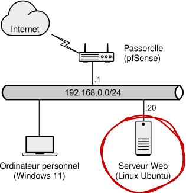

:::info Plan de la rencontre

- Présentation du TP2
- Droits et privilèges, principe du plus bas privilège
- Exercice sur les permissions (Linux)
:::

## Droits et privilèges

Dans un système d'information, les termes "droit" et "privilège" sont souvent utilisés de manière interchangeable, mais ils ont des nuances distinctes.

Un **droit**, ou **permission**, est une autorisation accordée à un utilisateur ou à un groupe d'utilisateurs pour effectuer une action spécifique sur une ressource comme un fichier ou un répertoire. Par exemple, Bob aura un accès en lecture seule sur le fichier patate.docx, alors que Alice aura les accès suffisants pour écrire et modifier ce même fichier.

Un **privilège** désigne une autorisation plus large, qui permet à un utilisateur d'effectuer des actions potentiellement sensibles ou critique sur le système, ou pouvant affecter plusieurs utilisateurs. On parlera souvent de privilèges d'administration, qui confèrent à un utilisateur le droit d'installer une application, de modifier des paramètres système ou d'accéder sans restriction à l'ensemble des fichiers de l'ordinateur.

Les systèmes permettent l'attribution des permissions et des privilèges avec un niveau de détail plus ou moins grand. On appelle ce concept la **granularité**. Plus la granularité est fine, plus il est possible de spécifier précisément quelles actions un utilisateur peut effectuer sur quelles ressources. Par exemple, le système de fichiers sous Linux utilisent un système de permissions très simple, composé de trois niveaux (lecture, écriture, exécution) pour trois identités (propriétaire, groupe, tous les autres). Windows, quant à lui, offre un système de permissions beaucoup plus granulaire (et complexe) au moyen de liste de contrôle d'accès (ACL).

## Principe du plus bas privilège

Le principe du plus bas privilège (ou principe du moindre privilège) est un concept fondamental en cybersécurité et en gestion des systèmes d'information. Il consiste à limiter les permissions, droits ou privilèges d'un utilisateur ou d'un processus au strict nécessaire pour accomplir ses tâches. Autrement dit:

- On souhaite **limiter au maximum** les permissions, droits ou privilèges d'un utilisateur.
- On souhaite fournir à l'utilisateur uniquement les droits dont il a besoin pour **accomplir son travail**, rien de plus.

On est parfois tenté, quand on commence et qu'on est tanné que ça ne marche pas, donner des droits maximum (comme `chmod 777 -R /dossier` sous Linux). Et hop! le TP fonctionne, super je suis maintenant un admin système Linux expert.

On vient de mettre le doigt sur un des problèmes classiques de la cybersécurité:

- L'informatique ça marche jamais et c'est dur de savoir pourquoi ça marche pas
- L'humain est fondamentalement paresseux et a une tendance naturelle à céder à la loi du moindre effort
- Pour rendre le système fonctionnel avec un minimum d'effort, on peut définir des permissions trop larges
- Quand le système marche, on a l'impression que le problème est réglé et on passe à autre chose
- Et si je change quelque chose, peut-être que ça ne marchera plus. **Si le système n'est pas brisé, n'y touche pas!**

:::info Anecdote de Vincent
*«&nbsp;J'étais consultant pour une entreprise financière. Un jour, j'investiguais la cause d'un problème et je me suis aperçu que je disposais de privilèges d'administrateur de domaine (ce qui confère des privilèges complets sur tous les systèmes de l'entreprise). Ça m'a surpris, car mon travail ne demandait pas un tel niveau de privilèges. Donc j'ai fait une petite recherche dans les systèmes pour savoir qui disposait de ces droits et c'était plus de la moitié du département de TI, y compris des consultants externes comme moi, des techniciens juniors et même des stagiaires! Clairement, quelqu'un n'a pas bien fait son travail! J'ai immédiatement alerté le département de la cybersécurité et la situation a été réglée rapidement.&nbsp;»*
:::

## Approche pour limiter les droits

Verifiez que les personnes qui ne devraient pas avoir accès n'ont pas accès.

On va donc voir ça sous l'angle vulnérabilité / exploit / correctif:

- La vulnérabilité, c'est que les permissions sont trop larges. L'utilisateur dispose de trop de permissions, dont certaines qui ne sont pas essentielles pour son travail. On contrevient au principe du plus bas privilège.
- L'exploit, c'est un accès non autorisé par un utilisateur sur le poste avec toutes les étapes détaillées
- Le correctif, c'est de limiter les permissions, on va pouvoir valider ce correctif comme tous les correctifs
  en s'assurant que l'exploit ne marche plus.

## EXERCICE: Optimisation des droits dans Apache

Pour cet exercice, vous devez ajouter créer votre environnement virtuel dans Labinfo et lui ajouter une VM calquée sur le modèle `420-3S4/R2.2 - Linux Permissions`. Déroulez la section suivante pour des détails sur la marche à suivre.

<details>
<summary>Préparation de l'environnement virtuel pour l'exercice</summary>

<Row><Column>
Avant de commencer cet exercice, vous devez minimalement mettre en place les machines virtuelles suivantes dans Labinfo:

- `TP2 - Passerelle pfSense`
- `TP2 - Client Windows`
- `R2.2 - Linux Permissions`

Suivez les instructions indiquées [dans l'énoncé du TP2](/tp/tp2).

La VM du serveur Linux pour cet exercice n'est pas la même que celle du TP! Toutefois, la passerelle et la machine Windows sont les mêmes. Vous n'avez pas besoin d'en faire deux copies!

</Column><Column>
<p align="right"></p>
</Column></Row>

</details>

Dans cet environnement, le client Windows sert à accéder au serveur Web à partir d'un navigateur (puisque ce réseau est isolé de celui du CÉGEP et que le serveur ne dispose pas d'une interface graphique). Sur la VM Linux, il y a trois comptes, dont un qui dispose de privilèges élevés (sudo).

| Nom d'utilisateur | Mot de passe | Sudo? |
| ----------------- | ------------ | ----- |
| alice             | Alice!       | Oui   |
| bob               | Bob!         | Non   |
| charlie           | Charlie!     | Non   |

Sous Linux, chaque fichier et dossier possède des permissions pour trois entités: l'**utilisateur propriétaire**, le **groupe propriétaire** et **tous les autres**.

Démarrez la VM et ouvrez un terminal. Pour connaître l'adresse IP de votre VM, démarrez une session avec Alice (mot de passe `Alice!`) et faites la commande `ip a` pour voir l'adresse IP. Elle devrait commencer par `192.168.`. Cette VM héberge un site Web à l'aide du logiciel Apache. Sur votre machine hôte, démarrez un navigateur Web et entrez `http://` suivi de l'adresse IP du serveur. Vous devriez voir un beau chat noir. C'est le chat de Vincent, un prof au département. **Il est très beau** (notez bien ceci pour l'examen).

Dans un terminal sur la VM, naviguez dans le répertoire `/var/www/html` avec la commande `cd`. Puis faites `ls -l` pour voir la liste de permissions des fichiers.

Quelles sont les **permissions minimum** à donner au contenu de ce répertoire? Déjà on peut imaginer que Apache n'a pas besoin de droits en modification, puisqu'aucune modification n'est faite par le serveur Web. On va donc essayer avec des permissions lecture seule.

Avec la commande `chmod`, essayez plusieurs combinaisons en utilisant `index.html` pour tester. Après chaque tentative, tentez de rafraîchir la page.

- `sudo chmod 400 index.html` *(r-- --- ---)*
- `sudo chmod 040 index.html` *(--- r-- ---)*
- `sudo chmod 004 index.html` *(--- --- r--)*

Ok! Donc pour que ça fonctionne, il faut que les **autres utilisateurs** aient accès. Mais pourquoi les autres? N'y a-t-il pas un seul utilisateur à qui donner les droits?

Sous Linux, tous les services, dont le serveur web Apache, doivent avoir un compte utilisateur valide pour opérer. Quel est ce compte?

Déjà on sait qu'Apache n'opère pas avec le compte de Root. Autrement, la permission `400` lui aurait donné des droits, puisque Root est le propriétaire du fichier. Même chose pour `040`, on sait que l'utilisateur d'Apache n'est pas dans le groupe de Root. Quels autres comptes existent sur cette machine? Alice, Bob, et Charlie? Essayez de changer le propriétaire et donner tous les droits à Alice.

<Row><Column>
<ConsoleWindow title="/bin/bash" noCopy="true">
```bash
~$ sudo chown alice index.html
~$ sudo chmod 400 index.html
```
</ConsoleWindow>
</Column><Column>
<details>
<summary>Ce que font ces commandes...</summary>

- Change le propriétaire pour `alice`
- Change les permissions pour `r-- --- ---`
</details>
</Column></Row>

Ça fonctionne maintenant? Toujours pas... Alors, à qui donner les droits?

Apache opère avec un **pseudoutilisateur**. Les pseudoutilisateurs (*pseudouser*), appelés aussi **comptes de service**, sont créés pour donner des permissions minimales à un service.

Comment identifier le pseudoutilisateur de Apache? La plus simple est d'aller voir dans le fichier de configuration `/etc/apache2/envvars`. Vous pouvez utiliser la commande suivante.

<ConsoleWindow title="/bin/bash" noCopy="true">
```bash
~$ cat /etc/apache2/envvars | grep APACHE_RUN_USER
```
</ConsoleWindow>

Cette technique ne fonctionne que pour Apache; les autres applications ont des fichiers de configuration différents. Une autre option, plus générale, serait de regarder quel utilisateur est propriétaire du processus apache2.

<ConsoleWindow title="/bin/bash" noCopy="true">
```bash
~$ ps aux | grep apache2
```
</ConsoleWindow>

Vous constaterez qu'il y a plusieurs processus: un opère en tant que `root` alors que d'autres opèrent en tant que `www-data`. Un peu de recherche dans la documentation d'Apache, et on apprend que c'est `www-data` qui est responsable de lire le contenu du site Web afin de l'envoyer en réponse aux requêtes des internautes.

Bref, vous savez maintenant que c'est l'utilisateur `www-data` qui a besoin de droits sur les fichiers du site. Et désignant ce pseudoutilisateur comme propriétaire, vous pouvez donner les droit à lui et seulement à lui.

<Row><Column>
<ConsoleWindow title="/bin/bash" noCopy="true">
```bash
~$ sudo chown alice index.html
~$ sudo chmod 400 index.html
```
</ConsoleWindow>
</Column><Column>
<details>
<summary>Ce que font ces commandes...</summary>

- Change le propriétaire pour `www-data`
- Change les permissions pour `r-- --- ---`
</details>
</Column></Row>


Bon ça va bien maintenant, Apache a désormais les droits en lecture, et la page Web peut être affichée. Mais il y a un problème... plus personne ne peut modifier le fichier! Et on ne voudrait surtout pas donner accès en modification aux autres utilisateurs! Alors on fait quoi?

Sous Linux, il y a 2 propriétaires: un utilisateur et un groupe. Alors on peut créer un groupe qui contiendra les comptes utilisateurs qui auront des droits en écriture.

Premièrement, créez un nouveau groupe pour les développeurs et ajoutez les utilisateurs qui devront mettre à jour le site (par exemple, bob et charlie sont les développeurs).

<Row><Column>
<ConsoleWindow title="/bin/bash" noCopy="true">
```bash
~$ sudo groupadd webdevs           
~$ sudo usermod -a -G webdevs bob  
~$ sudo usermod -a -G webdevs charlie
~$ cat /etc/group | grep webdevs   
```
</ConsoleWindow>
</Column><Column>

<details>
<summary>Ce que font ces commandes...</summary>

- Crée un nouveau groupe nommé `webdevs`
- Ajoute (-a) `bob` au Groupe (-G) `webdevs`
- Ajoute (-a) `charlie` au Groupe (-G) `webdevs`
- Affiche les membres du groupe
</details>

</Column></Row>

Ensuite on ajoute ce groupe comme groupe propriétaire et on lui donne des droits en lecture et écriture.

<Row><Column>
<ConsoleWindow title="/bin/bash" noCopy="true">
```bash
~$ sudo chown www-data:webdevs index.html
~$ sudo chmod 460 index.html
```
</ConsoleWindow>
</Column><Column>

<details>
<summary>Ce que font ces commandes...</summary>

- Affecte la paire propriétaire/groupe propriétaire
- Change les permissions pour `r-- rw- ---`
</details>
</Column></Row>

Finalement, vous avez trouvé la formule gagnante, vous pouvez modifier les permissions du reste du site Web en suivant la même logique.

<Row><Column>
<ConsoleWindow title="/bin/bash" noCopy="true">
```bash
~$ sudo chown -R www-data:webdevs /var/www/html/*
~$ sudo chmod -R 460 /var/www/html/*
```
</ConsoleWindow>
</Column><Column>
<details>
<summary>Ce que font ces commandes...</summary>

Même chose que les commandes précédentes, mais elles se font récursivement sur tous les fichiers contenus dans le répertoire `/var/www/html`
</details>
</Column></Row>

Sachez que ceci est un exemple simple, mais il existe plusieurs autres manières d'optimiser les permissions sur un serveur Web.

:::tip Pour le TP2...
Il y a dans le TP2 un problème qui est dû à des permissions trop larges.

Vous devrez valider avec le prof que vous avez bien identifié le problème et fournir un correctif.

Pour rappel, on valide un correctif en s'assurant que l'exploit prévu :

- fonctionne avant le correctif
- ne fonctionne plus après le correctif
:::

---

## Exercices / _Capture-the-flag_

<details>
<summary>🚩 En octal (2 points)</summary>

**Objectif**: convertir une table de permissions de la notation symbolique à la notation numérique (octale).

Voici trois tables de permissions :

```text
A : rw-r-----
B : rwxr-xr-x
C : r--rw----
```

**Votre mission**:

1. Convertir la table A en octal, ce qui te donne **a**
2. Convertir la table B en octal, ce qui te donne **b**
3. Convertir la table C en octal, ce qui te donne **c**
4. La valeur du CTF sera `CEM{a-b-c}`

Collecte tes points CTF : https://ctf.info.cegepmontpetit.ca/challenges

</details>

<details>
<summary>🚩 En symbolique (2 points)</summary>

**Objectif**: convertir une permission octale en notation symbolique.

Un administrateur a lancé ces deux commandes :

```bash
chmod 604 ./annonce.txt
chmod 710 ./outil.sh
```

**Votre mission**:

1. Écrire la table de permissions de `annonce.txt` en notation symbolique (9 caractères), ce qui te donne **a**
2. Écrire la table de permissions de `outil.sh` en notation symbolique (9 caractères), ce qui te donne **b**
3. La valeur du CTF sera `CEM{a_b}`

Collecte tes points CTF : https://ctf.info.cegepmontpetit.ca/challenges

</details>

<details>
<summary>🚩 Lire un ls (2 points)</summary>

**Objectif**: savoir lire le propriétaire, le groupe et la table de permissions dans la sortie de `ls -l`.

```text
bob@serveur:/srv/finances$ ls -l
-rw-r----- 1 alice comptables 2048 Sep 22 10:14 budget.xlsx
```

Bob fait partie du groupe `comptables`.

**Votre mission**:

1. Identifier l'utilisateur propriétaire, ce qui te donne **proprio**
2. Identifier le groupe propriétaire, ce qui te donne **groupe**
3. Bob peut-il modifier `budget.xlsx` ? (`oui` ou `non`), ce qui te donne **ecrire**
4. La valeur du CTF sera `CEM{proprio-groupe-ecrire}`

Collecte tes points CTF : https://ctf.info.cegepmontpetit.ca/challenges

</details>

<details>
<summary>🚩 Qui peut lire (2 points)</summary>

**Objectif**: déterminer quelle partie de la table de permissions s'applique à chaque utilisateur.

```text
-rw-r----- 1 root rh 5120 Sep 22 08:00 salaires.csv
```

| Utilisateur | Groupes | Sudo? |
| -- | -- | -- |
| alice | alice, sudo | Oui |
| bob | bob, rh | Non |
| carol | carol | Non |

**Votre mission**:

1. Qui peut lire le fichier avec `cat salaires.csv`, **sans** utiliser sudo ? Ça te donne **sans_sudo**
2. Qui d'autre peut quand même lire le fichier en utilisant `sudo cat salaires.csv` ? Ça te donne **avec_sudo**
3. La valeur du CTF sera `CEM{sans_sudo-avec_sudo}`

Collecte tes points CTF : https://ctf.info.cegepmontpetit.ca/challenges

</details>

<details>
<summary>🚩 Compte de service (2 points)</summary>

**Objectif**: identifier le pseudoutilisateur (compte de service) d'un service Linux.

```text
alice@serveur:~$ ps aux | grep apache2
root        812  0.0  0.4  6588 4412 ?  Ss  08:01  0:00 /usr/sbin/apache2 -k start
www-data    815  0.0  0.3  7212 3380 ?  S   08:01  0:00 /usr/sbin/apache2 -k start
www-data    816  0.0  0.3  7212 3380 ?  S   08:01  0:00 /usr/sbin/apache2 -k start
alice      1344  0.0  0.0  6480 2280 pts/0 S+ 09:12 0:00 grep --color=auto apache2
```

**Votre mission**:

1. Identifier le pseudoutilisateur qui lit les fichiers du site Web, ce qui te donne **compte**
2. Trouver dans les notes de cours le nom de la variable du fichier `/etc/apache2/envvars` qui définit ce compte, ce qui te donne **variable**
3. La valeur du CTF sera `CEM{compte-variable}`

Collecte tes points CTF : https://ctf.info.cegepmontpetit.ca/challenges

</details>

<details>
<summary>🚩 chmod en série (2 points)</summary>

**Objectif**: appliquer des modifications de permissions en notation symbolique.

Le fichier `rapport.txt` a les permissions **640**. On lance ensuite, dans l'ordre :

```bash
chmod g+w,o=r ./rapport.txt
chmod u-w ./rapport.txt
```

**Votre mission**:

1. Donner les permissions en octal après la première commande, ce qui te donne **p1**
2. Donner les permissions en octal après la deuxième commande, ce qui te donne **p2**
3. La valeur du CTF sera `CEM{p1-p2}`

Collecte tes points CTF : https://ctf.info.cegepmontpetit.ca/challenges

</details>

<details>
<summary>🚩 Traverser le répertoire (2 points)</summary>

**Objectif**: comprendre l'effet des permissions sur un répertoire.

```text
bob@serveur:~$ ls -ld /home/alice /home/alice/partage /home/alice/partage/note.txt
drwxr-x--x 14 alice alice 4096 Sep 20 14:35 /home/alice
drwx------  2 alice alice 4096 Sep 22 09:10 /home/alice/partage
-rw-r--r--  1 alice alice  120 Sep 22 09:11 /home/alice/partage/note.txt
```

Bob n'est pas membre du groupe `alice`. Il connaît le nom du fichier et lance `cat /home/alice/partage/note.txt`.

**Votre mission**:

1. La commande de Bob fonctionne-t-elle ? (`oui` ou `non`), ce qui te donne **lecture**
2. Quelle **seule** permission faut-il ajouter aux autres utilisateurs sur le répertoire `partage` pour que la commande de Bob fonctionne ? (une lettre), ce qui te donne **permission**
3. La valeur du CTF sera `CEM{lecture-permission}`

Collecte tes points CTF : https://ctf.info.cegepmontpetit.ca/challenges

</details>

<details>
<summary>🚩 Le fichier de trop (2 points)</summary>

**Objectif**: repérer une permission qui contrevient au principe du plus bas privilège.

```text
alice@serveur:/var/www/html$ ls -l
-r--rw---- 1 www-data webdevs  1840 Sep 20 11:02 index.html
-rwxrwxrwx 1 www-data webdevs   512 Sep 21 16:47 config.php
-r--rw---- 1 www-data webdevs 91233 Sep 20 11:02 chat.jpg
-r--rw---- 1 www-data webdevs  2210 Sep 20 11:02 style.css
```

**Votre mission**:

1. Identifier le fichier dont les permissions sont trop larges, ce qui te donne **fichier**
2. Donner ses permissions actuelles en octal, ce qui te donne **octal**
3. La valeur du CTF sera `CEM{fichier-octal}`

Collecte tes points CTF : https://ctf.info.cegepmontpetit.ca/challenges

</details>

<details>
<summary>🚩 Pas récursif (2 points)</summary>

**Objectif**: comprendre la différence entre une modification simple et une modification récursive.

```text
bob@poste:~$ ls -l projet/rapport.txt
-rw-r--r-- 1 bob bob 3021 Sep 22 10:00 projet/rapport.txt
bob@poste:~$ chmod 700 ./projet
```

**Votre mission**:

1. Donner les permissions en octal de `projet/rapport.txt` après la commande, ce qui te donne **octal**
2. Donner l'interrupteur (sans le tiret) qu'il aurait fallu ajouter à `chmod` pour modifier aussi le contenu du répertoire, ce qui te donne **option**
3. La valeur du CTF sera `CEM{octal-option}`

Collecte tes points CTF : https://ctf.info.cegepmontpetit.ca/challenges

</details>

<details>
<summary>🚩 Sudo ou pas sudo (2 points)</summary>

**Objectif**: savoir quelles commandes demandent des privilèges d'administration.

Bob a ouvert une session avec son compte (non root). Il veut lancer les commandes suivantes :

- **a)** `chmod 600 ~/notes.txt` (Bob est propriétaire du fichier)
- **b)** `adduser dave`
- **c)** `groups bob`
- **d)** `usermod -aG sudo carol`
- **e)** `passwd -l root`

**Votre mission**:

1. Identifier les commandes qui doivent être précédées de `sudo` pour fonctionner
2. Écrire leurs lettres en ordre alphabétique (exemple : `ab`), ce qui te donne **lettres**
3. La valeur du CTF sera `CEM{lettres}`

Collecte tes points CTF : https://ctf.info.cegepmontpetit.ca/challenges

</details>

<details>
<summary>🚩 Qui est dans le groupe (2 points)</summary>

**Objectif**: lire les fichiers qui définissent les utilisateurs et les groupes sous Linux.

```text
alice@serveur:~$ grep -E "^(sudo|webdevs):" /etc/group
sudo:x:27:alice
webdevs:x:1001:bob,carol
alice@serveur:~$ grep www-data /etc/passwd
www-data:x:33:33:www-data:/var/www:/usr/sbin/nologin
```

**Votre mission**:

1. Donner le GID du groupe `webdevs`, ce qui te donne **gid**
2. Identifier le seul utilisateur qui peut utiliser `sudo`, ce qui te donne **sudoer**
3. Donner l'UID du pseudoutilisateur `www-data`, ce qui te donne **uid**
4. La valeur du CTF sera `CEM{gid-sudoer-uid}`

Collecte tes points CTF : https://ctf.info.cegepmontpetit.ca/challenges

</details>

<details>
<summary>🚩 Refuser l'emporte (3 points)</summary>

**Objectif**: calculer les permissions effectives dans une ACL Windows, avec l'autorisation, le refus et les permissions avancées.

Liste de contrôle d'accès du fichier `rapport.docx` :

| Principal de sécurité | Permission | Type |
| -- | -- | -- |
| Utilisateurs | Lecture | Autoriser |
| techniciens | Modification | Autoriser |
| stagiaires | Écriture | Refuser |

Bob est membre des groupes `Utilisateurs`, `techniciens` et `stagiaires`.

**Votre mission**:

1. Bob peut-il lire le fichier ? (`oui` ou `non`), ce qui te donne **lire**
2. Bob peut-il modifier le contenu du fichier ? (`oui` ou `non`), ce qui te donne **ecrire**
3. Bob peut-il supprimer le fichier ? (`oui` ou `non`), ce qui te donne **supprimer** (indice : le tableau des permissions avancées)
4. La valeur du CTF sera `CEM{lire-ecrire-supprimer}`

Collecte tes points CTF : https://ctf.info.cegepmontpetit.ca/challenges

</details>

<details>
<summary>🚩 Modification ou contrôle total (2 points)</summary>

**Objectif**: comprendre de quelles permissions avancées sont composées les permissions de base sous Windows.

En vous servant du tableau des **permissions avancées** des notes de cours (section « Privilèges et permissions sous Windows »).

**Votre mission**:

1. Compter le nombre de permissions avancées comprises dans **Modification**, ce qui te donne **modif**
2. Compter le nombre de permissions avancées comprises dans **Contrôle total**, ce qui te donne **total**
3. La valeur du CTF sera `CEM{modif-total}`

Collecte tes points CTF : https://ctf.info.cegepmontpetit.ca/challenges

</details>

<details>
<summary>🚩 Admin sous Windows (2 points)</summary>

**Objectif**: distinguer ce qui est vrai et ce qui est faux à propos des comptes et privilèges sous Windows.

1. Un membre du groupe Administrateurs doit faire une élévation (UAC) pour installer une application
2. Par défaut, le compte Administrateur intégré (*built-in*) est lui aussi soumis à UAC
3. Un humain peut ouvrir une session avec le compte SYSTEM
4. Le propriétaire d'un fichier peut en modifier les permissions, même s'il n'a aucun droit dessus
5. Quand on retire un utilisateur du groupe Administrateurs, il perd ses privilèges immédiatement dans sa session déjà ouverte

**Votre mission**:

1. Pour chaque énoncé, répondre `V` (vrai) ou `F` (faux)
2. Écrire les réponses dans l'ordre (exemple : `VVVVV`), ce qui te donne **reponses**
3. La valeur du CTF sera `CEM{reponses}`

Collecte tes points CTF : https://ctf.info.cegepmontpetit.ca/challenges

</details>

<details>
<summary>🚩 Script de sauvegarde (2 points)</summary>

**Objectif**: appliquer le principe du plus bas privilège avec un compte de service et un groupe.

Le script `/opt/backup/backup.sh` est lancé chaque nuit par le compte de service `backup`. Les exigences sont :

- le compte `backup` doit pouvoir **lire et exécuter** le script, mais pas le modifier;
- les administrateurs du groupe `ops` doivent pouvoir le **lire et le modifier**, mais pas l'exécuter;
- personne d'autre ne doit y avoir accès.

**Votre mission**:

1. Donner la paire utilisateur:groupe propriétaire à passer à `chown`, ce qui te donne **proprio** (format `utilisateur:groupe`)
2. Donner les permissions minimales en octal à passer à `chmod`, ce qui te donne **octal**
3. La valeur du CTF sera `CEM{proprio-octal}`

Collecte tes points CTF : https://ctf.info.cegepmontpetit.ca/challenges

</details>


## ANNEXE: Privilèges et permissions sous Linux

Le système de permissions de fichiers sous Linux (et autres systèmes de type UNIX comme MacOSX et BSD) est basé sur trois catégories d'utilisateurs et trois types de permissions.

### Utilisateurs et privilèges d'administration

Sous Linux, les privilèges déterminent les actions qu'un utilisateur peut effectuer sur le système.

Les **utilisateurs** représentent des individus (humains ou non) qui sont autorisés à effectuer des tâches en leur nom sur le système d'exploitation. Chaque utilisateur dispose d'un identifiant unique appelé UID (*User IDentifier*). Les utilisateurs peuvent faire partie d'un ou plusieurs **groupes**, identifiés par leur GID (*Group IDentifier*).

Les utilisateurs sont autorisés à démarrer une session sur le système et à exécuter des programmes et des scripts en leur nom. L'étendue des actions que les utilisateurs peuvent accomplir est dictée par leurs permissions sur les fichiers et les répertoires. Ils disposent d'un profil, c'est-à-dire un emplacement qui leur est réservé dans le système de fichiers. Le profil est un répertoire du même nom que l'utilisateur, sous `/home/` et est représenté par le caractère raccourci `~` (le *tilde*). Normalement, seul l'utilisateur propriétaire de son profil y a accès.

Il existe un utilisateur spécial appelé *superutilisateur* ou `root`. C'est un compte qui a un contrôle total sur le système d'exploitation. Il peut créer et supprimer des utilisateurs et des groupes, donner ou retirer des privilèges, modifier la configuration globale du système comme sa configuration IP et s'approprier n'importe quel fichier et répertoire. Son UID est 0. Pour des raisons de sécurité, il est parfois interdit de démarrer une session avec cet utilisateur car il est très puissant. À la place, on va définir un groupe d'utilisateurs, les *sudoers*, qui seront autorisés à "demander" à `root` de poser une action au moyen de la commande `sudo` (diminutif de *SuperUser DO*).

Voici quelques commandes utiles pour gérer les utilisateurs et les groupes:

| Action                                                  | Commande                       |
| :------------------------------------------------------ | :----------------------------- |
| Activer le compte root                                  | `sudo passwd`                  |
| Désactiver le compte root                               | `sudo passwd -l root`          |
| Créer l'utilisateur Bob                                 | `sudo adduser bob`             |
| Supprimer l'utilisateur Bob                             | `sudo deluser bob`             |
| Créer le groupe Techniciens                             | `sudo addgroup techniciens`    |
| Supprimer le groupe Techniciens                         | `sudo delgroup techniciens`    |
| Ajouter l'utilisateur Bob au groupe Techniciens         | `sudo adduser bob techniciens` |
| Donner des droits de sudo à l'utilisateur Bob           | `sudo usermod -aG sudo bob`    |
| Vérifier les groupes dont fait partie l'utilisateur Bob | `groups bob`                   |

:::info Sudo ou pas sudo?
Vous remarquerez que les commandes précédentes commencent presque toutes par `sudo`. C'est parce que le seul utilisateur autorisé à lancer ces commandes est *root*. Si vous n'êtes pas loggé en root, vous devez utiliser `sudo` pour que la commande soit exécutée en tant que *root*. Si, au contraire, vous êtes loggé *root*, ou si vous avez basculé votre terminal en root avec la commande `su`, vous n'avez pas besoin d'utiliser la commande `sudo`.

Règle générale, n'utilisez pas la commande `sudo` à moins qu'y être obligé.
:::

### Fonctionnement des permissions

Chaque fichier et dossier possède un **utilisateur propriétaire**, un **groupe propriétaire** et une **table de permissions** qui définit le niveau d'accès pour ses trois catégories d'utilisateurs:

- L'**utilisateur propriétaire** désigne le compte utilisateur qui possède le fichier ou le dossier. C'est généralement son créateur. Les fichiers appartenant à l'administrateur du système ont pour propriétaire l'utilisateur `root`.
- Le **groupe propriétaire** désigne un ensemble d'utilisateurs qui partagent des permissions communes sur le fichier ou le dossier. Les groupes sont définis dans le fichier `/etc/groups`. Souvent, c'est un groupe qui s'appelle comme l'utilisateur et qui ne contient que l'utilisateur.
- La **table de permissions** contient les permissions conférées à l'utilisateur propriétaire, au groupe propriétaire ainsi qu'à tous les autres utilisateurs.

On peut voir ces trois éléments avec la commande `ls -al`:

```text
bob@machine:~$ ls -al
total 5
drwxr-x--x 14 bob  bob  4096 Sep 27 14:35 .
drwxr-xr-x 17 root root 4096 Feb 10  2023 ..
-rw-rw-r--  1 bob  bob   132 Dec 17  2022 allo.txt
-rw-rw-r--  1 bob  bob   176 Dec 18  2022 bonjour.txt
drwxrwxr-x  1 bob  bob   176 Oct 11  2023 mondossier
│└┬┘└┬┘└┬┘   └─┬─┘└─┬─┘
│ │  │  │      │    │
│ │  │  │      │    └── Groupe propriétaire (g)
│ │  │  │      └─────── Utilisateur propriétaire (u)
│ │  │  │               ┌──────────────────────┐
│ │  │  │            ┌──│ TABLE DE PERMISSIONS │────────────────────────────┐
│ │  │  │            │  └──────────────────────┘                            │
│ │  │  └────────────┼─ Permissions (rwx) des autres utilisateurs (o)       │
│ │  └───────────────┼─ Permissions (rwx) du groupe propriétaire (g)        │
│ └──────────────────┼─ Permissions (rwx) de l'utilisateur propriétaire (u) │
│                    └──────────────────────────────────────────────────────┘
└────────────────────── Indique si c'est un répertoire (d), un lien (l) ou 
                        un fichier (-)
```

La table de permissions est constituée de 3 parties:

- Utilisateur propriétaire (u)
- Groupe propriétaire (g)
- Autres utilisateurs (o)

Pour chaque catégorie, il existe trois permissions possibles:

|         | Permission | Valeur | Effet sur un fichier             | Effet sur un répertoire                                                     |
| ------- | ---------- | ------ | -------------------------------- | --------------------------------------------------------------------------- |
| **`r`** | lecture    | 4      | Lire le contenu du fichier       | Lister les fichiers et sous-répertoires dans le répertoire                  |
| **`w`** | écriture   | 2      | Modifier le contenu du fichier   | Ajouter et supprimer des fichiers et des répertoires                        |
| **`x`** | exécution  | 1      | Exécuter le fichier ou le script | Traverser le répertoire pour accéder à des fichiers ou des sous-répertoires |

### Modifier les permissions (*chmod*)

La commande pour modifier les permissions d'un fichier est `chmod` et s'utilise au moyen de deux types de notation: symbolique et numérique.

:::info Permissions nécessaires
Pour effectuer des changements sur la table de permissions, il faut soit:

- Être **propriétaire** du fichier ou du répertoire
- Être le **superutilisateur** du système (*root*) ou précéder la commande de `sudo` (en supposant qu'on dispose du privilège de *sudoer*)
:::

#### Notation symbolique

La notation symbolique utilise des lettres pour représenter les utilisateurs et les types de permissions :

- **`u`** : utilisateur (propriétaire)
- **`g`** : groupe
- **`o`** : autres utilisateurs
- **`a`** : tous (u, g, et o)

Les types de permissions sont représentés par :

- **`r`** : lecture
- **`w`** : écriture
- **`x`** : exécution

Les opérateurs utilisés sont :

- **`+`** : ajouter une permission
- **`-`** : retirer une permission
- **`=`** : définir une permission exacte

:::note Exemples
**`chmod u+r ./fichier.txt`**<br/>
Ajoute (+) la permission de lecture (r) à l'utilisateur propriétaire (u)

**`chmod g-w ./fichier.txt`**<br/>
Retire (-) la permission d'écriture (w) au groupe propriétaire (g)

**`chmod o=x ./fichier.txt`**<br/>
Définit (=) la permission d'exécution (x) aux autres utilisateurs (o)

**`chmod a=rwx ./fichier.txt`**<br/>
Définit (=) tous les droits (rwx) à tout le monde (a)

**`chmod u=rw,og=r ./fichier.txt`**<br/>
Définit (=) des droits en lecture et écriture (rw) à l'utilisateur propriétaire (u) et des droits en lecture seule (r) au groupe et aux autres (og)
:::

#### Notation numérique (octale)

La permission effective peut être toute combinaison de *x*, de *w* et de *r*. Chacune de ces composantes est un *drapeau* qui peut être représenté par un *bit* qui est soit activé (1) ou inactif (0). Il y a donc 3 bits, donc 2^3 possibilités, soit 8 au total. On peut les représenter à l'aide d'un chiffre de 0 à 7.

| Permission | Valeur binaire | Valeur octale | Description                          |
| ---------- | -------------- | ------------- | ------------------------------------ |
| `---`      | `000`          | **0**         | Aucun droit                          |
| `--x`      | `001`          | **1**         | Exécution seulement                  |
| `-w-`      | `010`          | **2**         | Écriture seulement                   |
| `-wx`      | `011`          | **3**         | Écriture et exécution                |
| `r--`      | `100`          | **4**         | Lecteure seulement                   |
| `r-x`      | `101`          | **5**         | Lecture et exécution                 |
| `rw-`      | `110`          | **6**         | Lecture et écriture (sans exécution) |
| `rwx`      | `111`          | **7**         | Accès complet                        |

Comme il y a trois types d'utilisateur, la table de permissions se résume à un nombre constitué de trois chiffres de 0 à 7.

- Le premier pour l'utilisateur propriétaire (u)
- Le deuxième pour le groupe propriétairte (g)
- Le troisième pour les autres utilisateurs (o)

:::note Exemple
La table de permissions `rwxr-x--x` donne **751** en octal, car:

- `rwx` pour l'utilisateur propriétaire, donc **7**
- `r-x` pour le groupe propriétaire, donc **5**
- `--x` pour les autres utilisateurs, donc **1**

Ainsi, la commande `chmod 751 ./fichier.txt`  modifie la table de permissions à `rwxr-x--x`.
:::

:::caution
La commande `chmod 777` ou `chmod a=rwx` affecte des droits complets pour tout le monde. C'est habituellement une mauvaise pratique.
:::

:::tip
Vous pouvez essayer ce [calculateur de *chmod* en ligne](https://chmod-calculator.com/)!
:::

### Modifier le propriétaire (*chown*)

Pour modifier l'utilisateur propriétaire et/ou le groupe propriétaire d'un fichier ou d'un répertoire, il faut utiliser la commande `chown`. Les privilèges nécessaires sont les mêmes que pour la `chmod`: il faut disposer de privilèges administratifs ou être propriétaire de la ressource.

- Pour modifier l'utilisateur propriétaire pour "bob": `chown bob ./fichier.txt`
- Pour modifier le groupe propriéraire pour "profs": `chown :profs ./fichier.txt`
- Pour modifier les deux en même temps: `chown bob:profs ./fichier.txt`

:::tip
N'oubliez pas! Si vous disposez de privilèges d'administration sur la machine, vous pouvez modifier les permissions et les propriétaires sur n'importe quelle ressource même si vous n'êtes pas propriétaire de celle-ci. Il vous suffit d'utiliser la commande `sudo`, qui revient à "demander" au superutilisateur (root) de faire quelque chose ("**S**uper**U**ser **DO**").

<ConsoleWindow title="/bin/bash" noCopy="true">
```bash
~$ sudo chown bob:profs ./fichier.txt
~$ sudo chmod 775 ./fichier.txt
```
</ConsoleWindow>
:::

### Modification récursive

Les fichiers et les dossiers sont des éléments du système de fichiers disposant chacun de leur table de permissions individuelle. Les commandes `chmod` et `chown` visent un élément seulement. Ainsi, la commande `chmod 777 ./mondossier` ne modifie les permissions que du répertoire lui-même, pas des fichiers et répertoires qui se trouvent à l'intérieur. Pour faire en sorte que la modification soit automatiquement appliquée à tout son contenu, on doit lancer la commande **récursivement** en activant l'interrupteur `-R` (majuscule). Par exemple:

<ConsoleWindow title="/bin/bash" noCopy="true">
```bash
~$ chmod -R 777 ./mondossier
~$ chown -R bob:profs ./mondossier
```
</ConsoleWindow>

## ANNEXE: Privilèges et permissions sous Windows

Sous Windows, on retrouve deux types de comptes utilisateurs:

- Les comptes locaux, définis localement sur la machine. On peut les voir dans la console de gestion de l'ordinateur.
- Les comptes de domaine, qui sont définis centralement dans un système de gestion de l'identité nommé Active Directory. C'est pour cette raison que vous ne voyez pas votre compte sur les ordinateurs du laboratoire.

La gestion des privilèges sous Windows est particulièrement granulaire, mais les deux principaux niveaux sont les utilisateurs limités (les membres du groupe Utilisateurs) et les administrateurs (ceux du groupe Administrateurs). Dans la console de gestion de l'ordinateur, il y a plusieurs autres groupes qui donnent des privilèges particuliers, mais ils sont rarement utilisés.

Lorsque Windows est installé, un compte administrateur est créé automatiquement. Il existe un compte administrateur par défaut (dit *intégré* ou *built-in*) qui se nomme "Administrateur" sur les installations en français ou "Administrator" sur les installations en anglais. Il se peut que ce compte soit désactivé, si un autre compte administrateur a été créé durant l'installation de Windows.

Les privilèges d'administration sont contrôlés par l'appartenance au groupe Administrateurs. Pour donner des privilège, on ne fait qu'ajouter l'utilisateur au groupe, et pour l'enlever on le retire du groupe. Le changement est effectif au prochain redémarrage de session.

Tout comme sous Linux, les utilisateurs limités ne sont pas autorisés à effectuer des changements sur le système, à l'exception de leur profil personnel se trouvant dans `C:\Users\nom de l'utilisateur`. Ils peuvent lire et écrire dans les répertoires faisant partie de leur profil, comme le bureau, les documents, les images, etc. Toute action qui modifie des paramètres globaux du système, comme la configuration IP, la création d'un utilisateur ou l'installation d'une application, requiert des droits admin (donc doit provenir d'un compte membre du groupe Administrateurs).

### Contrôle de l'accès utilisateur (UAC)

L'équivalent Windows de Sudo se nomme *User Access Control* (UAC). Le mode de fonctionnement d'UAC est très différent de sudo, mais l'objectif est le même: limiter l'étendue de nos propres privilèges à moins d'en avoir vraiment besoin. Autrement dit, même si l'on est administrateur de notre système, il faut effectuer une **élévation** afin de s'octroyer ce privilège pour une action précise, soit en sélectionnant "Exécuter en tant qu'administrateur" ou en cliquant Oui à la fenêtre de consentement. 

Ce mécanisme a pour but de réduire l'impact d'une erreur de manipulation, mais aussi d'empêcher à des logiciels malveillant d'hériter des privilèges élevés de l'utilisateur.

:::info L'administrateur intégré (*built-in*)
Par défaut, UAC est actif pour tous les administrateurs à l'exception du compte Administrateur intégré. C'est pourquoi il faut généralement éviter d'utiliser ce compte; tout ce qu'on fait hérite automatiquement des plus hauts privilèges sur le système.
:::

### Permissions de base

Le système de permissions du système de fichiers NTFS sous Windows utilise des listes de contrôle d'accès (ACL) pour gérer les autorisations. Chaque fichier et dossier possède une ACL qui spécifie les droits d'accès pour les utilisateurs et les groupes. Les permissions courantes incluent la lecture, l'écriture, l'exécution et la modification. Les administrateurs peuvent définir des permissions de manière granulaire pour contrôler précisément qui peut accéder et modifier les ressources.

Sous Windows, les permissions sont beaucoup plus riches et granulaires que sous Linux, ce qui donne plus de possibilités mais augmente également la complexité.

On accède à la liste de contrôle d'accès via l'onglet **Sécurité** dans les propriétés du fichier ou du dossier (clic-droit, propriétés). Celle-ci comprend plusieurs entrées de contrôle d'accès qui affectent un ensemble de permissions, ou autorisations, à un *principal de sécurité* (un utilisateur ou un groupe). 


Les permissions qu'on peut affecter sont:

| Permission                         | Effet sur un fichier                                    | Effet sur un répertoire                                                           |
| ---------------------------------- | ------------------------------------------------------- | --------------------------------------------------------------------------------- |
| **Contrôle total**                 | Lire, écrire et supprimer le fichier et ses permissions | Lire, écrire, supprimer et modifier les permissions des fichiers et sous-dossiers |
| **Modification**                   | Lire, écrire et supprimer le fichier                    | Lire et écrire les fichiers, supprimer le dossier                                 |
| **Lecture et exécution**           | Lire le contenu du fichier et l'exécuter                | Lister le contenu, lire et exécuter les fichiers                                  |
| **Afficher le contenu du dossier** | n/a                                                     | Lister le contenu, lire et exécuter les fichiers (héritage par dossier seulement) |
| **Lecture**                        | Accéder au contenu du fichier                           | Accéder au contenu des fichiers et lister le contenu du dossier                   |
| **Écriture**                       | Écrire le contenu du fichier                            | Créer des fichiers et sous-dossiers                                               |


On retrouve souvent certains groupes et utilisateurs spéciaux:

- **Authenticated Users** (Utilisateurs authentifiés) : Représente n'importe quel utilisateur ayant réussi à s'authentifier au système.
- **SYSTEM** (Système) : C'est le compte sur lequel opèrent les services en arrière-plan. Contrairement au root de Linux, il est impossible pour un humain de se *logger* avec ce compte.
- **Administrateurs** : Les membres du groupe des administrateurs qui se sont élevés en tant qu'admin.
- **Utilisateurs** : Les membres du groupe des utilisateurs, qui contrôle qui a le droit de démarrer une session sur cet ordinateur

Sur les postes dans un domaine d'entreprise, comme dans les labos du CÉGEP, les utilisateurs et groupes qui se retrouvent dans cette liste peuvent être issus du système centralisé de gestion de l'identité, Active Directory.


### Propriétaire

Tous les fichiers et répertoires possèdent un propriétaire, soit un utilisateur ou un groupe. Le propriétaire n'a pas forcément tous les droits sur le fichier, mais il a le pouvoir d'en modifier les permissions afin de se donner les droits. Le propriétaire est visible dans les paramètres de sécurité avancés.

Les membres du groupe des Administrateurs sont autorisés à prendre possession du fichier ou du dossier.


### Autoriser et refuser

Chaque autorisation peut être affectée en mode **autoriser** (*allow*) ou **refuser** (*deny*).

- Autoriser signifie que cette autorisation est accordée
- Refuser signifie que cette autorisation est explicitement refusée.

Le refus l'emporte toujours sur l'autorisation. Par exemple, l'utilisateur `bob` est membre du groupe des `techniciens`. Dans la liste de contrôle d'accès du fichier `secret.txt`, Bob se voit accorder l'autorisation de Lecture, mais les techniciens ont Contrôle Total: Refuser, Bob sera incapable de lire le fichier.

:::tip
Vous pouvez trouver un outil pour évaluer les permissions effectives dans les propriétés avancées des permissions, sous l'onglet **Accès effectif**.


:::

### Héritage des permissions

Les permissions peuvent être héritées des dossiers parents. Cela signifie que les fichiers et sous-dossiers peuvent automatiquement recevoir les permissions définies pour leur dossier parent.

Lorsqu'une permission est héritée d'un dossier parent


### Permissions avancées

Les permissions de base sont en fait un ensemble de permissions plus granulaires. On n'entrera pas dans les détails dans ce cours, mais voici, pour référence, un tableau qui indique de quelles petites permissions sont composées les permissions de base:

| Autorisation | Contrôle total | Modification | Lecture / exécution | Afficher le contenu du dossier | Lecture | Écriture |
| :-- | :--: | :--: | :--: | :--: | :--: | :--: |
| Parcourir le dossier / exécuter le fichier  | ✅ | ✅ | ✅ | ✅ | | |
| Afficher le dossier / lire le fichier       | ✅ | ✅ | ✅ | ✅ | ✅ | |
| Lire les attributs                          | ✅ | ✅ | ✅ | ✅ | ✅ | |
| Lire les attributs étendus                  | ✅ | ✅ | ✅ | ✅ | ✅ | |
| Créer des fichiers / écrire des données     | ✅ | ✅ | | | | ✅ |
| Créer des dossiers / ajouter des données    | ✅ | ✅ | | | | ✅ |
| Écrire les attributs                        | ✅ | ✅ | | | | ✅ |
| Écrire les attributs étendus                | ✅ | ✅ | | | | ✅ |
| Supprimer les sous-dossiers et les fichiers | ✅ | | | | | |
| Supprimer                                   | ✅ | ✅ | | | | |
| Lire les autorisations                      | ✅ | ✅ | ✅ | ✅ | ✅ | |
| Modifier les autorisations                  | ✅ | | | | | |
| Appropriation                               | ✅ | | | | | |


