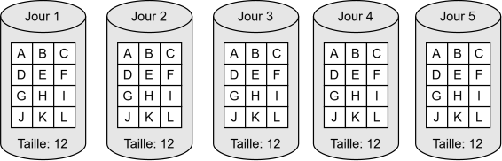
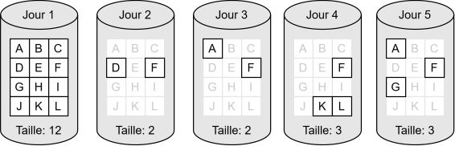
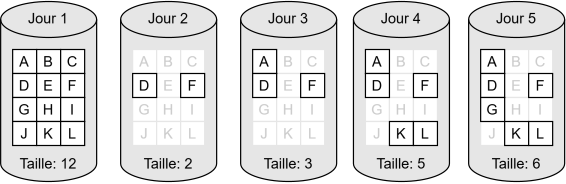
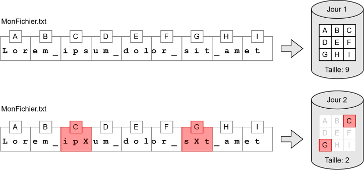
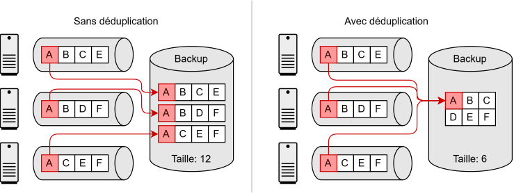

:::note Plan de la rencontre

| Durée | Activité |
| -- | -- |
| 15 min | Pourquoi les sauvegardes, stratégie, RPO et RTO, scénarios |
| 25 min | Types de sauvegardes, synchronisation et redondance, où conserver et comment sécuriser les sauvegardes |
| 10 min | Exercice en classe : quelle stratégie résiste à quel incident? |
| 5 min | Optimisation et restauration (survol) |
| 15 min | Exercice 1 : Robocopy |
| 30 min | Exercice 2 : rsync |
| 20 min | _Capture-the-flag_ |

:::

## Pourquoi les sauvegardes

Plusieurs événements peuvent détruire ou corrompre des données : bris d'équipement, erreur humaine,
vol, incendie, cyberattaque, rançongiciel, etc. On peut mettre en place des mécanismes pour éviter
ces incidents, mais le risque zéro n'existe pas.

Une **sauvegarde** (ou *backup*) est une **copie** de nos données qui permet de les **restaurer**
telles qu'elles étaient avant l'incident. La sauvegarde protège l'**intégrité** et la
**disponibilité** des données.

## Stratégie de sauvegarde

Ce n'est pas parce qu'on a fait un backup qu'on a une stratégie. Les données ne sont pas toutes
égales : certaines sont plus critiques, d'autres changent plus souvent. Pour élaborer une stratégie,
on se pose quatre questions :

- **Quoi?** Qu'est-ce qu'on sauvegarde? (tous les fichiers, seulement certains, les configurations...)
- **Quand?** À quelle fréquence? (chaque heure, chaque jour, chaque semaine...)
- **Où?** Sur quel médium et à quel endroit? (le même disque, une clé USB dans un coffre-fort, le *cloud*...)
- **Combien?** Combien de versions précédentes conserve-t-on, et pendant combien de temps?

### RPO et RTO

Il faut aussi penser à la **restauration**. Deux indicateurs permettent de fixer nos objectifs :

| Indicateur | Question | Exemple |
| -- | -- | -- |
| **RPO** (*Recovery Point Objective*) | Quelle quantité de données peut-on se permettre de **perdre**? | RPO de 24h : une sauvegarde chaque nuit à minuit suffit. Si le disque brise à 18h, on perd 18h de modifications, ce qui est acceptable. |
| **RTO** (*Recovery Time Objective*) | Combien de temps peut-on se permettre d'être **en panne**? | RTO de 4h : le service doit être remis en fonction moins de 4h après la panne. |

Plus le RPO et le RTO sont bas, plus la stratégie coûte cher. On doit donc bien comprendre le besoin
et faire des choix.

### Scénarios à discuter

En équipe de deux, choisissez **deux** scénarios. Pour chacun, proposez une stratégie (quoi? quand?
où? combien?) et estimez un RPO et un RTO raisonnables. Vous pourrez raffiner votre réponse à la fin
de la théorie.

**Scénario 1 : Le lanceur d'alerte.**
A.A. (on ne gardera que ses initiales pour conserver son anonymat) a trouvé 30 Go de données ultra
compromettantes pour un gouvernement corrompu. Il souhaite absolument s'assurer que rien ne
disparaitra jamais.

**Scénario 2 : L'étudiant et ses travaux.**
Andy a mis beaucoup d'efforts dans ses travaux. Il y a même des TP qui fonctionnent c'est fou. Il a
un ordi à la maison avec un seul disque et voudrait vraiment que ça soit pas cher, genre gratuit en
fait.

**Scénario 3 : L'admin et son site web.**
John Jean est administrateur d'un site web tout petit qui change jamais. Il a passé un peu de temps
à faire la configuration de Apache. Le contenu du site a été fait par un jeune génie, mais on ne sait
plus trop où il est, et John Jean, lui, ne comprend rien au HTML.

**Scénario 4 : Le site de commerce en ligne.**
Pierre Doré administre le site de commerce en ligne d'une bijouterie très populaire qui vend des
bijoux sur mesure partout sur la planète. Les clients passent des commandes à toute heure du jour et
de la nuit. Si les données sont perdues, les demandes spéciales des clients seront inaccessibles et
les bijoutiers ne pourront plus travailler.

---

## Types de sauvegardes

### Sauvegarde complète

Copie **tous** les fichiers sélectionnés, à chaque fois, même ceux qui n'ont pas changé.

<p align="center"></p>

Si une perte survient après le jour 5, on n'a besoin que de la **sauvegarde 5** pour tout restaurer.

### Sauvegarde incrémentielle

Copie uniquement ce qui a changé depuis la **dernière sauvegarde**, peu importe son type.

<p align="center"></p>

Si une perte survient après le jour 5, on a besoin des sauvegardes **1 à 5** : la dernière complète
et **toutes** les incrémentielles qui suivent.

### Sauvegarde différentielle

Copie tout ce qui a changé depuis la dernière sauvegarde **complète**.

<p align="center"></p>

Si une perte survient après le jour 5, on a besoin des sauvegardes **1 et 5 seulement** : la dernière
complète et la dernière différentielle.

### En résumé

| Type | Avantages | Inconvénients |
| -- | -- | -- |
| **Complète** | Restauration simple et rapide, aucune dépendance entre les sauvegardes | Beaucoup d'espace, plus longue à effectuer |
| **Incrémentielle** | La plus rapide et la plus petite | Restauration plus complexe; une seule sauvegarde corrompue compromet toutes les suivantes |
| **Différentielle** | Compromis : restauration avec seulement 2 jeux | Grossit chaque jour jusqu'à la prochaine complète |

En pratique, on combine souvent les types. Par exemple, une sauvegarde complète chaque dimanche et une
différentielle les autres jours.

---

## Sauvegarde, synchronisation, redondance

Copier des données ailleurs n'est pas nécessairement une sauvegarde.

La **synchronisation** rend deux emplacements identiques, à intervalles réguliers ou en temps réel
(ex. : OneDrive, Dropbox, `robocopy /MIR`, `rsync --delete`). Il lui manque un élément essentiel :
l'**historique**. Si un rançongiciel chiffre vos fichiers, la version chiffrée sera synchronisée et
la bonne copie sera écrasée. Certains services combinent les deux : OneDrive, par exemple, conserve
aussi un **historique des versions**.

La **redondance** multiplie les composants d'un système pour tolérer les pannes. L'exemple classique
est le **RAID 1** (mise en miroir) : deux disques sont écrits en même temps et sont toujours
identiques. Si un disque brise, l'autre prend le relais le temps de le remplacer. À plus grande
échelle, plusieurs serveurs peuvent se partager les mêmes données en temps réel : c'est une
**grappe** (*cluster*).

:::warning Note importante
**RAID n'est pas une stratégie de sauvegarde!**

- La redondance (comme RAID) protège contre les **défaillances matérielles**.
- La sauvegarde permet de restaurer les données à **un état antérieur**.

Un fichier supprimé ou chiffré sur un disque en miroir est instantanément supprimé ou chiffré sur
l'autre. La redondance est un excellent complément à la sauvegarde, mais ne la remplace jamais.
:::

---

## Où conserver les sauvegardes

Une copie située trop près des données originales peut être touchée par le **même incident**. On
répartit donc les sauvegardes entre différents supports et emplacements.

### Supports de stockage

| Support | Forces | Faiblesses |
| -- | -- | -- |
| Disque dur (HDD) | Grande capacité, peu coûteux, durable | Lent, surtout en accès aléatoire (rarement un problème pour une sauvegarde) |
| Disque SSD | Très rapide | Plus cher par To, nombre limité de cycles d'**écriture** |
| NAS (serveur de stockage réseau) | Sur un autre appareil, accessible par le réseau (SMB, NFS) | Un rançongiciel peut l'atteindre par le réseau si les accès sont mal contrôlés |
| Infonuagique | Copie hors site sans posséder d'autre site | Coût mensuel, dépend d'Internet |
| Supports amovibles (clé USB, disque externe) | Peuvent être débranchés : sauvegarde **hors ligne** | Faciles à perdre ou à voler |
| Bandes magnétiques (LTO) | Jusqu'à des dizaines de To par cartouche, très bas coût par To, longue conservation | Lentes, accès séquentiel, lecteur coûteux |

### Sur site ou hors site

Une sauvegarde **sur site** se restaure rapidement et coûte moins cher, mais un incendie, une
inondation ou un cambriolage peut détruire à la fois les données et leur sauvegarde. Une sauvegarde
**hors site** (voûte sécurisée, fournisseur externe, *cloud*) survit à un sinistre, mais elle est plus
lente à récupérer.

---

## Sécuriser les sauvegardes

Une sauvegarde contient une copie de données importantes : c'est donc une **cible** pour un
attaquant. Il faut la protéger contre le vol, la modification, le chiffrement ou la suppression.

### La règle 3-2-1

- **3** copies des données
- sur **2** supports différents
- dont **1** copie hors site

Exemple : la base de données d'un serveur Web se trouve sur le disque du serveur (original), sur un
autre serveur sur site (restauration rapide) et dans le *cloud* (copie hors site).

### Contrôle d'accès

Un rançongiciel chiffre tous les fichiers accessibles par le compte qu'il a compromis. Si ce compte
peut modifier la sauvegarde, elle sera chiffrée elle aussi.

Le compte qui **utilise** les données ne doit donc **pas** pouvoir modifier la sauvegarde. La
sauvegarde est effectuée par un **autre compte** (souvent `root` ou `système`), généralement au moyen
d'une tâche planifiée (*cron* sous Linux).

### Sauvegarde hors ligne

Une copie stockée sur un support **déconnecté** (disque externe débranché, bande magnétique dans une
voûte) ne peut pas être atteinte par une cyberattaque. Il faut toutefois choisir un support fiable à
long terme et de bonnes conditions de conservation (température, humidité, etc.).

### Sauvegarde immuable

Certains systèmes interdisent toute modification ou suppression des données pendant une période
définie (ex. : 30 jours), **même par un administrateur**. Nuance : immuable ne veut pas dire
inaccessible. Un attaquant ne pourra pas effacer la sauvegarde, mais il pourrait tenter de rendre le
serveur de sauvegarde inutilisable.

### Chiffrement

Le chiffrement rend les données illisibles pour quiconque ne possède pas la **clé**. On peut chiffrer
les fichiers eux-mêmes (archive chiffrée), le système de fichiers ou le support au complet (BitLocker,
FileVault). C'est particulièrement important pour les supports amovibles et les copies hors site, qui
peuvent être perdus ou volés. Nous reviendrons sur le chiffrement plus tard dans la session.

- Le **chiffrement** protège la **confidentialité** des sauvegardes.
- Le **contrôle d'accès**, le stockage **hors ligne** et l'**immutabilité** protègent contre leur
**modification ou leur suppression**.

:::caution
Si on perd la clé de chiffrement, les données sauvegardées sont perdues à tout jamais.
:::

### Exercice en classe : quelle stratégie résiste à quel incident?

Voici six stratégies de sauvegarde :

1. Backup dans un deuxième répertoire sur le serveur
2. Backup sur un NAS situé dans le même réseau local
3. Backup sur un NAS immuable dans le même réseau local, avec une période de rétention de 30 jours
4. Backup sur un disque dur externe USB qui est débranché par la suite
5. Backup sur un NAS immuable **et** un disque USB (combinaison de 3 et 4)
6. Backup sur bandes magnétiques hors site

Pour chaque incident, indiquez quelles stratégies permettent de récupérer les données.

| Incident | 1. | 2. | 3. | 4. | 5. | 6. |
| -- | -- | -- | -- | -- | -- | -- |
| Suppression accidentelle des données | | | | | | |
| Bris du disque dur | | | | | | |
| Ransomware sur le serveur | | | | | | |
| Ransomware sur le NAS | | | | | | |
| Compromission du compte admin du serveur | | | | | | |
| Compromission du compte admin du NAS | | | | | | |
| Destruction physique du site | | | | | | |

Revenez ensuite sur les scénarios du début : modifieriez-vous vos stratégies?

---

## Mesures d'optimisation

Conserver plusieurs versions prend beaucoup d'espace. Trois techniques permettent de réduire la
quantité de données à transférer et à stocker, et elles peuvent être combinées :

| Technique | Principe | Contrepartie |
| -- | -- | -- |
| **Compression** | Représenter les mêmes données avec moins d'espace. Le texte se compresse très bien; les fichiers JPEG, MP4 ou ZIP, déjà compressés, très peu. | Demande du calcul à la sauvegarde et à la restauration |
| **Blocs modifiés** | Pour un gros fichier (disque de VM, base de données), ne sauvegarder que les **blocs** qui ont changé plutôt que le fichier complet. | Système plus complexe pour reconstruire les données |
| **Déduplication** | Ne stocker qu'une seule fois des données (ou des blocs) identiques. 30 ordinateurs qui ont le même fichier de 500 Mo n'occupent que 500 Mo, pas 15 Go. | Traitement supplémentaire pour repérer les doublons |

<Row><Column>
<p align="center"></p>
</Column><Column>
<p align="center"></p>
</Column></Row>

---

## Restauration

**Une sauvegarde qui n'a jamais été restaurée est une sauvegarde dont le fonctionnement n'a pas été
vérifié.**

- **Tests de restauration** : on restaure périodiquement quelques fichiers dans un emplacement
temporaire, ou un serveur complet dans une VM isolée. On découvre ainsi une sauvegarde incomplète, un
support défectueux, une procédure erronée, une clé de chiffrement perdue ou un mot de passe oublié.
- **Intégrité** : « Les données ont-elles été conservées correctement? » On calcule une **empreinte**
(un *hash*) de chaque fichier lors de la sauvegarde. Si l'empreinte du fichier restauré est
différente, il a été endommagé ou modifié. Comme un hash a toujours la même petite taille, il est
peu coûteux de le conserver.
- **Cohérence** : « Les données restaurées forment-elles ensemble un état utilisable? » Si une base de
données est modifiée **pendant** sa sauvegarde, les fichiers copiés peuvent provenir de deux moments
différents et être inutilisables une fois restaurés ensemble. Des mécanismes comme
[Volume Shadow Copy](https://learn.microsoft.com/fr-ca/windows-server/storage/file-server/volume-shadow-copy-service)
sous Windows prennent un instantané (*snapshot*) pour copier tous les fichiers au même moment.

---

## Exercice 1 - Sauvegarde avec Robocopy

Dans cet exercice, vous utiliserez **Robocopy** sous Windows pour observer la différence entre une
**copie** et un **miroir**.

#### Préparation

Créez la structure suivante et ajoutez quelques lignes de texte différentes dans chaque fichier :

```text
💽 C:\
 └─ 📁 EspaceLabo
     ├─ 📁 Documents
     │   ├─ 🗒️ travail.txt
     │   ├─ 🗒️ notes.txt
     │   └─ 🗒️ important.txt
     └─ 📁 Sauvegarde
```

#### Étape 1 - Effectuer une première copie

<ConsoleWindow title="cmd.exe">
```cmd
C:\> robocopy C:\EspaceLabo\Documents C:\EspaceLabo\Sauvegarde /E
```
</ConsoleWindow>

:::note Questions
- Quels fichiers ont été copiés?
- À quoi sert l'option `/E`?
:::

#### Étape 2 - Modifier, ajouter et supprimer

Dans le dossier `Documents` : modifiez `notes.txt`, créez `nouveau.txt` et supprimez `important.txt`.
Exécutez à nouveau la même commande.

<ConsoleWindow title="cmd.exe">
```cmd
C:\> robocopy C:\EspaceLabo\Documents C:\EspaceLabo\Sauvegarde /E
```
</ConsoleWindow>

:::note Questions
- Robocopy a-t-il recopié tous les fichiers? Lesquels ont été copiés?
- Le fichier `important.txt` existe-t-il toujours dans `Sauvegarde`?
:::

#### Étape 3 - Créer un miroir

<ConsoleWindow title="cmd.exe">
```cmd
C:\> robocopy C:\EspaceLabo\Documents C:\EspaceLabo\Sauvegarde /MIR
```
</ConsoleWindow>

:::note Questions
- Qu'est-il arrivé au fichier `important.txt`?
- Quelle différence observez-vous entre `/E` et `/MIR`?
- Un rançongiciel chiffre tous les fichiers de `Documents`, puis une tâche automatique exécute la
commande avec `/MIR`. Qu'arrive-t-il aux bonnes copies dans `Sauvegarde`?
:::

**À retenir :** `/MIR` fait de la destination un **miroir** de la source. C'est une synchronisation,
pas une sauvegarde : il n'y a aucun historique.

---

## Exercice 2 - Sauvegarde avec rsync

**rsync** est l'équivalent Linux de Robocopy. Il copie et synchronise des fichiers entre deux
emplacements : sur la même machine, vers un disque externe ou vers un autre serveur par SSH.

Dans cet exercice, **Alice** (qui a les privilèges sudo) doit protéger les documents de **Bob**. Cet
exercice se fait sur la même machine virtuelle que
[le dernier cours](./10-r2.2.md#exercice-optimisation-des-droits-dans-apache).

:::tip
Pour éviter de changer de session, ouvrez un terminal sur le compte d'Alice et utilisez `su - bob`
pour agir en tant que Bob, puis `exit` pour revenir à Alice.
:::

### Étape 1 - Bob crée ses documents

<ConsoleWindow title="/bin/bash" backgroundColor="#300A24">
```bash
bob@serveur:~$ mkdir ./documents
bob@serveur:~$ echo "Lorem ipsum dolor sit amet." > ./documents/latin
bob@serveur:~$ echo "Mrrou miaou miaou rrrrouin!" > ./documents/minou
bob@serveur:~$ echo "Jop HoHwI' taj Q'oy qeylIS." > ./documents/klingon
```
</ConsoleWindow>

### Étape 2 - Alice fait une sauvegarde

<ConsoleWindow title="/bin/bash" backgroundColor="#300A24">
```bash
alice@serveur:~$ sudo rsync -a --delete /home/bob/ /var/backups/bob_backup/
alice@serveur:~$ ls /var/backups/bob_backup
alice@serveur:~$ sudo ls -ld /var/backups/bob_backup
```
</ConsoleWindow>

| Option / chemin | Description |
| -- | -- |
| `-a` | Mode archive : copie récursive qui préserve les permissions, les propriétaires, les dates, etc. |
| `--delete` | Supprime de la destination les fichiers qui n'existent plus dans la source (équivalent de `/MIR`). |
| `/home/bob/` | Répertoire source (le `/` final signifie « le **contenu** du répertoire ») |
| `/var/backups/bob_backup/` | Répertoire de destination, créé s'il n'existe pas |

:::note Question
Pourquoi Alice ne peut-elle pas lister le contenu de la sauvegarde **sans** sudo? Qui en est le
propriétaire?
:::

### Étape 3 - Restaurer un fichier

Bob supprime son fichier `klingon` par erreur :

<ConsoleWindow title="/bin/bash" backgroundColor="#300A24">
```bash
bob@serveur:~$ rm ./documents/klingon
```
</ConsoleWindow>

Alice le restaure à partir de la sauvegarde, puis vérifie son propriétaire :

<ConsoleWindow title="/bin/bash" backgroundColor="#300A24">
```bash
alice@serveur:~$ sudo rsync -a /var/backups/bob_backup/documents/klingon /home/bob/documents/
alice@serveur:~$ sudo ls -l /home/bob/documents
```
</ConsoleWindow>

:::note Question
À qui appartient le fichier restauré? Qu'est-ce qui aurait été différent avec un simple `sudo cp`, et
quel problème cela aurait-il causé à Bob?
:::

### Étape 4 - Un rançongiciel sur le compte de Bob

Un rançongiciel qui s'exécute avec les droits de Bob va chiffrer tout ce que Bob peut modifier. Or,
Bob est **propriétaire** de sa sauvegarde. Vérifions :

<ConsoleWindow title="/bin/bash" backgroundColor="#300A24">
```bash
bob@serveur:~$ echo "CHIFFRÉ - PAYEZ 1 BITCOIN" > /var/backups/bob_backup/documents/latin
bob@serveur:~$ cat /var/backups/bob_backup/documents/latin
```
</ConsoleWindow>

Première idée d'Alice : retirer tous les droits d'écriture sur la sauvegarde (le commutateur `-R`
applique la modification de façon **récursive**).

<ConsoleWindow title="/bin/bash" backgroundColor="#300A24">
```bash
alice@serveur:~$ sudo chmod -R a-w /var/backups/bob_backup
```
</ConsoleWindow>

Le rançongiciel essaie à nouveau :

<ConsoleWindow title="/bin/bash" backgroundColor="#300A24">
```bash
bob@serveur:~$ echo "CHIFFRÉ" > /var/backups/bob_backup/documents/minou
bob@serveur:~$ chmod -R u+w /var/backups/bob_backup
bob@serveur:~$ echo "CHIFFRÉ" > /var/backups/bob_backup/documents/minou
```
</ConsoleWindow>

:::note Questions
- Pourquoi la première tentative échoue-t-elle, mais pas la troisième?
- Même si Bob ne pouvait pas modifier la sauvegarde, que se passerait-il à la prochaine exécution de
`rsync -a --delete` si le rançongiciel avait chiffré les fichiers de `/home/bob/documents`?
:::

Notre sauvegarde a deux problèmes : le compte compromis peut la modifier, et elle n'a **aucun
historique**.

### Étape 5 - Une sauvegarde versionnée et hors de portée

Bob refait ses documents :

<ConsoleWindow title="/bin/bash" backgroundColor="#300A24">
```bash
bob@serveur:~$ echo "Lorem ipsum dolor sit amet." > ./documents/latin
bob@serveur:~$ echo "Mrrou miaou miaou rrrrouin!" > ./documents/minou
```
</ConsoleWindow>

Alice crée un répertoire accessible **seulement par root**, puis y fait une copie **datée** :

<ConsoleWindow title="/bin/bash" backgroundColor="#300A24">
```bash
alice@serveur:~$ sudo mkdir /var/backups/bob_versions
alice@serveur:~$ sudo chmod 700 /var/backups/bob_versions
alice@serveur:~$ sudo rsync -a /home/bob/ /var/backups/bob_versions/$(date +%F_%H%M%S)/
alice@serveur:~$ sudo ls -l /var/backups/bob_versions
```
</ConsoleWindow>

- `$(date +%F_%H%M%S)` est remplacé par la date et l'heure (ex. : `2026-09-29_101530`). Chaque
exécution crée un **nouveau** répertoire au lieu d'écraser le précédent : on garde un historique.
- Il n'y a plus d'option `--delete` : on n'efface jamais une version précédente.

Le rançongiciel tente à nouveau d'atteindre la sauvegarde :

<ConsoleWindow title="/bin/bash" backgroundColor="#300A24">
```bash
bob@serveur:~$ ls /var/backups/bob_versions
```
</ConsoleWindow>

:::note Question
Les fichiers à l'intérieur de `bob_versions` appartiennent encore à `bob` (option `-a`). Pourquoi Bob
ne peut-il quand même pas les atteindre? Indice : quelle permission faut-il sur un répertoire pour le
traverser?
:::

### Étape 6 - Le rançongiciel frappe, on restaure

Le rançongiciel chiffre les documents de Bob :

<ConsoleWindow title="/bin/bash" backgroundColor="#300A24">
```bash
bob@serveur:~$ echo "CHIFFRÉ - PAYEZ 2 BITCOINS" > ./documents/latin
bob@serveur:~$ echo "CHIFFRÉ - PAYEZ 2 BITCOINS" > ./documents/minou
```
</ConsoleWindow>

La sauvegarde du soir s'exécute avant que quiconque s'en rende compte :

<ConsoleWindow title="/bin/bash" backgroundColor="#300A24">
```bash
alice@serveur:~$ sudo rsync -a /home/bob/ /var/backups/bob_versions/$(date +%F_%H%M%S)/
alice@serveur:~$ sudo ls -l /var/backups/bob_versions
```
</ConsoleWindow>

À vous de jouer : identifiez la version **d'avant** l'attaque et restaurez les documents de Bob.
Remplacez `DATE_AVANT` par le nom du bon répertoire :

<ConsoleWindow title="/bin/bash" backgroundColor="#300A24">
```bash
alice@serveur:~$ sudo rsync -a /var/backups/bob_versions/DATE_AVANT/documents/ /home/bob/documents/
```
</ConsoleWindow>

Vérifiez, en tant que Bob, que les fichiers sont revenus et qu'il peut encore les modifier.

:::note Questions
- Chaque version est une copie **complète**. Quel problème cela pose-t-il après un an de sauvegardes
quotidiennes?
- Cette stratégie respecte-t-elle la règle 3-2-1? Que faudrait-il ajouter?
:::

### Pour aller plus loin (optionnel)

**Automatiser avec cron.** Avec `sudo crontab -e`, la ligne suivante lance la sauvegarde chaque nuit
à 2h. Dans une crontab, le caractère `%` doit être écrit `\%`.

```text
0 2 * * * rsync -a /home/bob/ /var/backups/bob_versions/$(date +\%F)/
```

**Des versions qui prennent peu d'espace.** L'option `--link-dest` de rsync crée chaque version en
réutilisant (par liens physiques) les fichiers inchangés depuis la version précédente. Chaque
version paraît complète, mais n'occupe que l'espace des fichiers modifiés. Consultez `man rsync`.

---

## Discussions

- Est-ce que **OneDrive** est un système de sauvegarde?
- Est-ce que **Git / GitHub** est un système de sauvegarde?
- Quelles caractéristiques doit avoir une sauvegarde pour nous protéger d'un rançongiciel?

---

## Exercices / _Capture-the-flag_

<details>
<summary>🚩 Combien de jeux (3 points)</summary>

**Objectif**: comprendre l'impact du type de sauvegarde sur la restauration.

Un serveur est sauvegardé chaque soir à 23h00 :

- le **dimanche** : sauvegarde complète
- du **lundi au samedi** : sauvegarde incrémentielle ou différentielle, selon la stratégie choisie

Le disque du serveur brise le **jeudi à 14h00**.

**Votre mission**:

1. Avec une stratégie **incrémentielle**, combien de jeux de sauvegarde faut-il restaurer ? Ça te donne **inc**
2. Avec une stratégie **différentielle**, combien de jeux de sauvegarde faut-il restaurer ? Ça te donne **diff**
3. La valeur du CTF sera `CEM{inc-diff}`

Collecte tes points CTF : https://ctf.info.cegepmontpetit.ca/challenges

</details>

<details>
<summary>🚩 Espace occupé (3 points)</summary>

**Objectif**: calculer l'espace de stockage utilisé par une stratégie de sauvegarde.

Un serveur de fichiers contient **500 Go** de données. Chaque jour, les utilisateurs modifient ou ajoutent **10 Go** de fichiers, et ce ne sont jamais les mêmes fichiers d'une journée à l'autre.

- Dimanche : sauvegarde **complète**
- Lundi au samedi : sauvegarde **incrémentielle** ou **différentielle**

**Votre mission**:

1. Calculer l'espace total occupé par les 6 sauvegardes **incrémentielles** de la semaine, en Go (sans compter la complète). Ça te donne **inc**
2. Calculer l'espace total occupé par les 6 sauvegardes **différentielles** de la semaine, en Go (sans compter la complète). Ça te donne **diff**
3. La valeur du CTF sera `CEM{inc-diff}`

Collecte tes points CTF : https://ctf.info.cegepmontpetit.ca/challenges

</details>

<details>
<summary>🚩 Combien de travail perdu (2 points)</summary>

**Objectif**: comprendre le lien entre la fréquence des sauvegardes et la quantité de données perdues.

Andy sauvegarde ses travaux **une fois par jour, à 23h00**. Son disque brise le lendemain à **16h00**, avant la sauvegarde du soir.

**Votre mission**:

1. Calculer le nombre d'heures de travail perdues, ce qui te donne **heures**
2. Pour réduire cette perte, doit-on **augmenter** ou **diminuer** la fréquence des sauvegardes ? Ça te donne **frequence**
3. La valeur du CTF sera `CEM{heures-frequence}`

Collecte tes points CTF : https://ctf.info.cegepmontpetit.ca/challenges

</details>

<details>
<summary>🚩 Le RAID en miroir (2 points)</summary>

**Objectif**: comprendre contre quoi un miroir protège, et contre quoi il ne protège pas.

Un serveur possède deux disques en miroir (RAID 1) : tout ce qui est écrit sur le premier disque est écrit en même temps sur le second. Il n'y a aucune autre sauvegarde.

**Votre mission**:

1. Ce montage protège-t-il contre la panne d'un des deux disques ? (`oui` ou `non`), ça te donne **panne**
2. Protège-t-il contre la suppression accidentelle d'un fichier par un utilisateur ? (`oui` ou `non`), ça te donne **suppression**
3. Protège-t-il contre un incendie dans la salle de serveurs ? (`oui` ou `non`), ça te donne **incendie**
4. La valeur du CTF sera `CEM{panne-suppression-incendie}`

Collecte tes points CTF : https://ctf.info.cegepmontpetit.ca/challenges

</details>

<details>
<summary>🚩 OneDrive est-ce une sauvegarde (2 points)</summary>

**Objectif**: comprendre la différence entre synchronisation et sauvegarde.

Les fichiers du dossier Documents d'un utilisateur sont synchronisés en continu avec OneDrive. Un rançongiciel chiffre tous les fichiers de ce dossier.

**Votre mission**:

1. Les fichiers chiffrés vont-ils être envoyés vers OneDrive par la synchronisation ? (`oui` ou `non`), ça te donne **synchro**
2. Parmi `chiffrement`, `compression`, `deduplication` et `versionnage`, quelle fonctionnalité du service permet malgré tout de récupérer les fichiers d'avant l'attaque ? Ça te donne **fonction**
3. La valeur du CTF sera `CEM{synchro-fonction}`

Collecte tes points CTF : https://ctf.info.cegepmontpetit.ca/challenges

</details>

<details>
<summary>🚩 Le bon médium (2 points)</summary>

**Objectif**: choisir le médium de stockage adapté à chaque besoin.

Voici quatre médiums :

- **B** : bande magnétique (*tape drive*)
- **I** : infonuagique (*cloud*)
- **S** : disque SSD
- **U** : clé USB

Et quatre besoins, en désordre :

1. Apporter 8 Go de fichiers chez un client, cet après-midi
2. Archiver 300 To pendant 10 ans, au plus bas coût par To
3. Restaurer une base de données le plus rapidement possible
4. Garder une copie hors site sans avoir à transporter quoi que ce soit

**Votre mission**:

1. Associer chaque besoin au médium le plus approprié
2. Écrire les lettres dans l'ordre des besoins (exemple : `BISU`), ce qui te donne **lettres**
3. La valeur du CTF sera `CEM{lettres}`

Collecte tes points CTF : https://ctf.info.cegepmontpetit.ca/challenges

</details>

<details>
<summary>🚩 Lecture seule (2 points)</summary>

**Objectif**: protéger une sauvegarde contre un rançongiciel en retirant les droits d'écriture.

Pour protéger la sauvegarde de Bob, Alice lance :

```bash
sudo chmod -R a-w /var/backups/bob_backup
```

Avant la commande, le répertoire `bob_backup` avait les permissions `drwxr-x---`.

**Votre mission**:

1. Donner les permissions du répertoire après la commande, en octal, ce qui te donne **octal**
2. Quel interrupteur fait en sorte que le changement s'applique aussi à tout le contenu du répertoire ? (sans le tiret), ça te donne **option**
3. La valeur du CTF sera `CEM{octal-option}`

Collecte tes points CTF : https://ctf.info.cegepmontpetit.ca/challenges

</details>

<details>
<summary>🚩 Toujours propriétaire (3 points)</summary>

**Objectif**: voir la limite de la protection en lecture seule quand le propriétaire est le compte compromis.

Après la commande d'Alice, la sauvegarde ressemble à ceci :

```text
alice@serveur:/var/backups$ ls -ld bob_backup
dr-xr-x--- 5 bob bob 4096 Sep 22 09:40 bob_backup
```

Un rançongiciel s'exécute sur le compte de Bob, avec exactement les droits de Bob.

**Votre mission**:

1. Qui est le propriétaire du répertoire de sauvegarde ? Ça te donne **proprio**
2. Quelle commande ce propriétaire peut-il lancer, **sans sudo**, pour se redonner le droit d'écriture ? (le nom de la commande seulement), ça te donne **commande**
3. La protection en lecture seule est-elle suffisante dans ce cas ? (`oui` ou `non`), ça te donne **suffisant**
4. La valeur du CTF sera `CEM{proprio-commande-suffisant}`

Collecte tes points CTF : https://ctf.info.cegepmontpetit.ca/challenges

</details>
