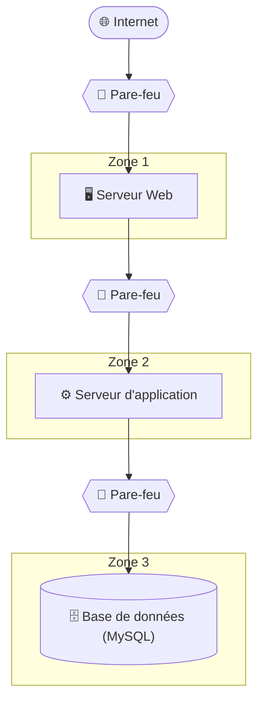

:::note Plan de la rencontre

- Les ports d'écoute
- Vulnérabilités et correctifs
- Les pare-feux
- Démonstration avec WireShark
- Exercices
:::

Vous avez sans doute entendu dire qu'un pare-feu sert à vous protéger des attaques provenant du réseau. Mais comment ça marche au juste?

## Les ports d'écoute

Tous les ordinateurs sur un réseau jouent à la fois le rôle de client et de serveur. Dans une dynamique client-serveur, le client est la machine qui utilise un service alors que le serveur est celle qui rend le service au client. Le client s'attend normalement à ce que le serveur doit disponible au moment où il souhaite passer sa requête, donc le serveur doit écouter en tout temps sur le réseau. 

Le serveur doit donc être accessible sur le réseau. Les clients le contactent au moyen de son adresse IP. Le serveur ouvre un **port d'écoute** correspondant au protocole de communication utilisé par convention pour chaque service. Par exemple, un navigateur Web (appelé aussi un client Web) passe ses requêtes HTTPS sur le port 443 du serveur, et donc le serveur Web a ouvert son port 443 pour recevoir les requêtes des clients.

### Identifier les ports ouverts

#### Netstat

Normalement, un système d'exploitation ouvre un port d'écoute à la demande d'un programme (ou service) qui s'exécute en arrière-plan.

On peut utiliser la commande `netstat -a` sous Linux et Windows afin d'obtenir des informations sur les connexions réseau, les ports utilisés et les statistiques des interfaces **sur son ordinateur**.

<ConsoleWindow title="cmd.exe">
```text
C:\> netstat -a

Connexions actives

  Proto  Adresse locale         Adresse distante       État
  TCP    0.0.0.0:135            MABELLEMACHINE:0       LISTENING
  TCP    0.0.0.0:445            MABELLEMACHINE:0       LISTENING
  TCP    0.0.0.0:902            MABELLEMACHINE:0       LISTENING
  TCP    0.0.0.0:912            MABELLEMACHINE:0       LISTENING
  TCP    0.0.0.0:2179           MABELLEMACHINE:0       LISTENING
  TCP    0.0.0.0:2701           MABELLEMACHINE:0       LISTENING
  TCP    0.0.0.0:3389           MABELLEMACHINE:0       LISTENING
  TCP    0.0.0.0:5040           MABELLEMACHINE:0       LISTENING
  TCP    0.0.0.0:5985           MABELLEMACHINE:0       LISTENING
  TCP    0.0.0.0:7680           MABELLEMACHINE:0       LISTENING
  ...    ...                    ...                    ...
```
</ConsoleWindow>

#### Nmap

Contrairement à `netstat`, `nmap` agit plutôt comme un outil de cartographie réseau. Bien qu’il existe certaines similarités entre les deux outils, `nmap` est principalement utilisé pour analyser le réseau et découvrir les ports et services ouverts **d’autres machines sur le réseau**. Voici un exemple de commande `nmap` sous Linux :

<ConsoleWindow title="/bin/bash" backgroundColor="#300A24">
```bash
~$ nmap www.siteexemplaire.com

Starting Nmap 7.93 ( https://nmap.org ) at 2025-10-08 19:05
Nmap scan report for www.siteexemplaire.com (203.0.113.42)
Host is up (0.12s latency).

PORT     STATE         SERVICE
25/tcp   open          smtp
80/tcp   open          http
53/udp   open          domain

Nmap done: 1 IP address (1 host up) scanned in 3.21 seconds
```
</ConsoleWindow>

### Quelques ports bien connus

Les ports TCP et UDP utilisés par les différents protocoles sont établis par convention dans les documents des normes d'Internet (les RFC). Voici certains ports bien connus pour des protocoles fréquemment utilisés:

| Protocole | Port(s) | Document de norme (RFC, autre...) |
| :-- | :-- | :-- |
| HTTP | 80/tcp | [RFC 2616](https://tools.ietf.org/html/rfc2616) |
| HTTPS | 443/tcp | [RFC 2818](https://tools.ietf.org/html/rfc2818) |
| FTP | 21/tcp | [RFC 959](https://tools.ietf.org/html/rfc959) |
| SSH | 22/tcp | [RFC 4251](https://tools.ietf.org/html/rfc4251) |
| Telnet | 23/tcp | [RFC 854](https://tools.ietf.org/html/rfc854) |
| SMTP | 25/tcp | [RFC 5321](https://tools.ietf.org/html/rfc5321) |
| DNS | 53/tcp/udp | [RFC 1035](https://tools.ietf.org/html/rfc1035) |
| DHCP | 67/udp (serveur), 68/udp (client) | [RFC 2131](https://tools.ietf.org/html/rfc2131) |
| POP3 | 110/tcp | [RFC 1939](https://tools.ietf.org/html/rfc1939) |
| MS-RPC | 135/tcp/udp (epmap), 49152-65535/tcp/udp (dyn)  | [MS-RPCE](https://learn.microsoft.com/en-us/openspecs/windows_protocols/ms-rpce/290c38b1-92fe-4229-91e6-4fc376610c15) |
| IMAP | 143/tcp | [RFC 3501](https://tools.ietf.org/html/rfc3501) |
| LDAP | 389/tcp | [RFC 4511](https://tools.ietf.org/html/rfc4511) |
| SMB | 445/tcp | [MS-SMB](https://learn.microsoft.com/en-us/openspecs/windows_protocols/ms-smb/f210069c-7086-4dc2-885e-861d837df688) |
| LDAPS | 636/tcp | [RFC 4511](https://tools.ietf.org/html/rfc4511) |
| Microsoft SQL Server| 1433/tcp, 1434/udp | [MC-SQLR](https://learn.microsoft.com/en-us/openspecs/windows_protocols/mc-sqlr/1ea6e25f-bff9-4364-ba21-5dc449a601b7) |
| NFS | 2049/tcp | [RFC 3010](https://tools.ietf.org/html/rfc3010) |
| MySQL | 3306/tcp | (non spécifié par une RFC) |
| Bureau à distance (RDP) | 3389/tcp | [MS-RDPBCGR](https://learn.microsoft.com/en-us/openspecs/windows_protocols/ms-rdpbcgr/5073f4ed-1e93-45e1-b039-6e30c385867c) |
| PostgreSQL | 5432/tcp | (non spécifié par une RFC) |


## Vulnérabilités

Un port ouvert n'est pas forcément un problème, bien au contraire: les ports d'écoute sont un élément essentiel au fonctionnement d'Internet. Tous les serveurs Web doivent obligatoirement écouter sur le port 443 et les serveurs SSH doivent obligatoirement écouter sur le port 22. Toutefois, plus les ports ouverts en écoute sont nombreux, plus le serveur répond à une multitude de protocoles et plus les chances que l'un de ces protocoles (ou du logiciel qui l'implémente) soit vulnérable. 

Par ailleurs, un port ouvert permet à une machine distante d'envoyer une requête au serveur, ce qui entraîne un traitement plus ou moins important, dépendant de la nature de la requête. Par exemple, une requête Web à un serveur déclenche une série d'actions sur le serveur: interprétation de la requête, validation de la session ou du cookie, formulation d'une requête à la base de données, interprétation du résultat, production dynamique de code HTML, renvoi de la réponse au client. Ce travail peut être exploité à des fins de déni de service distribué (DDoS), car ces attaques visent justement à surcharger les ressources computationnelles de l'ordinateur cible.


## Correctifs

Chaque port constitue un point d'entrée potentiel pour les attaques. On dit alors que la surface d'exposition est grande. Il est donc important de limiter les ports ouverts à seulement ce qui est nécessaire pour que le service fasse son travail (à l'instar du principe du plus bas privilège pour les permissions). Il y a plusieurs manières d'y parvenir.


### Fermer ou désactiver le service

On peut limiter la surface d'exposition en désactivant les services dont notre système n'a pas besoin. Par exemple, si notre machine sert strictement de serveur Web et rien d'autre, on devrait voir uniquement les ports TCP 443 (et peut-être aussi 80) en écoute. Si d'autres ports sont ouverts, il faut identifier le programme qui écoute sur le port et y mettre fin.

:::tip Identifier le programme derrière un port ouvert
Autant sous Linux que sous Windows, la commande `netstat -ano` permet d'obtenir la liste des ports ouverts (en mode "LISTENING") ainsi que l'identifiant du processus en exécution (PID). Vous pouvez ensuite retrouver le programme responsable dans le gestionnaire de tâches de Windows ou encore la commande `ps -ef | grep <PID>` sous Linux. Vous pouvez ensuite tenter de découvrir comment ces services sont démarrés (par exemple, `/etc/init.d` sous Linux, `services.msc` sous Windows...). 
:::

### Pare-feu local

Il n'est parfois pas possible ou souhaitable de désactiver complètement le service, car ce service a une utilité. Par exemple, il arrive que les administrateurs de système aient besoin du service SSH pour administrer le serveur à distance. Ça ne veut pas dire qu'on doit exposer ce port à tout Internet. Il se peut aussi qu'on souhaite empêcher à un utilisateur non-administrateur d'ouvrir un port (ça ne prend normalement pas de droits d'administration, seulement la capacité à lancer un programme qui ouvre un port). On utilise alors un pare-feu.

Le pare-feu est un logiciel dont l'objectif est de contrôler les entrées et sorties sur le réseau en laissant passer le trafic légitime et en bloquant le trafic indésirable. Il y a deux grandes catégories de pare-feux: le pare-feu local, qui tourne sur le serveur, et le pare-feu d'infrastructure, qui tourne sur d'autres équipements.

Linux Ubuntu et Windows possèdent tous deux un pare-feu local prêt à l'emploi. Dans les deux cas, il faut disposer des privilèges d'administrations pour modifier sa configuration. Ce pare-feu opère sur la machine et n'a donc aucun effet sur les autres systèmes, mais permet de bloquer des ports en amont et en aval. Il peut aussi être configuré de sorte qu'un port ne puisse être ouvert que par un programme spécifique.


### Pare-feu d'infrastructure

Le pare-feu d'infrastructure est un dispositif de sécurité déployé sur un réseau. Ce n'est pas un logiciel installé sur un serveur mais plutôt une machine à part entière en bordure de deux réseaux. Tout le trafic réseau passe par lui, qui se réserve le droit de laisser passer les paquets ou les détruire, un peu comme un poste de douane. Ainsi, même si on est administrateur de notre machine et qu'on laisse passer le trafic au moyen du pare-feu local, celui-ci pourrait ne pas pouvoir franchir le pare-feu d'infrastructure en bordure.

Une telle solution est très souvent implémentées dans les réseaux d'entreprises. Non seulement on dispose un pare-feu en bordure pour filtrer les requêtes provenant des utilisateurs externes, dans une zone isolée du réseau qu'on nomme la zone démilitarisée (DMZ), mais même dans le réseau interne on segmente le réseau en plusieurs sous-réseaux, chacun séparés par un pare-feu. Ainsi, par exemple, il n'y a que l'application qui peut se connecter au serveur de base de données.

Le diagramme suivant montre un exemple d'une telle architecture, qu'on appelle l'architecture 3-tiers.


Les pare-feux d'infrastructure sont souvent des produits commerciaux professionnels. Les principaux pare-feux sur la marché incluent:
- Cisco ASA
- Fortinet FortiGate
- Palo Alto Networks NGFW
- pfSense / NetGate

Plusieurs de ces pare-feux sont dits de "nouvelle génération" et offrent des fonctionnalités d'analyse de trafic, de filtrage de paquets et peuvent même procurer un service de VPN.

:::info Question quiz!
Est-ce qu'un pare-feu peut bloquer:
- L'accès au site web https://www.criminels.net
- L'accès à http://info.cegepmontpetit.ca (pour forcer l'utilisation de https)?
- L'accès à la page https://www.supersupersuper.com/pageinterdite.html (sans bloquer le reste du site)?
:::


## Configuration du pare-feu

La configuration du pare-feu se fait normalement au moyen de règles de filtrage de paquets. 

### Critères
Les règles sont basées sur plusieurs critères, notamment:
- L'adresse IP et le port de source
- L'adresse IP et le port de destination
- Le protocole utilisé (TCP, UDP, ICMP)

D'autres critères sont possiblement supportés par le pare-feu. Par exemple, le pare-feu de Windows permet d'ajouter un programme spécifique à une règle ainsi qu'un profil réseau (par exemple, un réseau privé vs. un réseau public). Aussi, certains pare-feux avancés peuvent inspecter le contenu des paquets pour détecter des menaces (pourvu que la communication ne soit pas chiffrée ou que le pare-feu puisse la déchiffrer).

### Types de règles
Typiquement, on peut définir deux types de règles:
- Les règles d'autorisation (allow) permettent le passage du trafic correspondant aux critères spécifiés
- Les règles de blocage (deny) bloquent le trafic réseau correspondant aux critères spécifiés

### Direction
Le pare-feu est en mesure de contrôler le trafic dans l'une ou l'autre des directions:
- Les règles de trafic entrant contrôlent le trafic qui est initié par un client distant vers nous.
- Les règles de trafic sortant contrôlent le trafic qui est initié par nous vers un serveur.

### Ordre des règles
Dans certains pare-feux, l'ordre des règles est important. Les règles de filtrage sont généralement évaluées dans un ordre séquentiel. Le pare-feu examine chaque paquet et applique la première règle correspondante. Si aucune règle ne correspond, une action par défaut (généralement le blocage) est appliquée. Ce ne sont toutefois pas tous les pare-feux qui fonctionnent comme ça: celui de Windows, par exemple, ne tient pas compte de l'ordre des règles.

:::caution Désactiver complètement le pare-feu?
Il peut être tentant de désactiver complètement le pare-feu pour "régler" un problème de connectivité. La désactivation du pare-feu (ou la création d'une règle très permissive) est rarement une solution définitive. Il peut être acceptable de désactiver le pare-feu temporairement, pour tester ou pour confirmer si le blocage provient du pare-feu, mais on doit le réactiver le plus rapidement possible.
:::


## Pare-feux locaux

### Pare-feu de Windows

Sous Windows, on peut gérer le pare-feu par le panneau de configuration "Pare-feu Windows Defender". Vous pouvez gérer les règles entrantes et sortantes en cliquant sur "paramètres avancés" ou en ouvrant la console `wf.msc`. Vous y trouverez un ensemble de règles que vous pouvez modifier. Sachez toutefois que dans un environnement d'entreprise (comme au CÉGEP Édouard-Montpetit), le pare-feu de Windows est généralement contrôlé centralement par les administrateurs du domaine.


### Pare-feu de Linux (Ubuntu)

Voici un site qui explique le fonctionnement du pare-feu par défaut de Linux Ubuntu:

https://documentation.ubuntu.com/server/how-to/security/firewalls/


## Démo: Capture de ports avec WireShark

Nous allons accéder au serveur http://perdus.com qui est plus simple parce qu'il fonctionne en HTTP simple:
1. ouvrez Chrome et tapez http://perdus.com mais sans appuyer sur Enter
2. ouvrez Firefox et tapez http://perdus.com mais sans appuyer sur Enter
3. ouvrez Wireshark et démarrez la capture sur l'interface ethernet
4. rapidement, allez appuyer sur Enter dans Chrome et Firefox
5. arrêtez la capture Wireshark avec le bouton carré rouge
6. nous allons regarder les différentes requêtes HTTP qui ont été faites et en particulier les ports source / destination


## Exercices

### Exercice 1 : Fermeture de ports entrants

Dans cet exercice, nous allons fermer un port spécifique pour bloquer le trafic entrant sur ta machine.

1. Ouvre la console du pare-feu Windows en lançant la commande `wf.msc` depuis l'invite de commande ou le menu Démarrer.
2. Crée une règle pour **bloquer le port 445** en entrée.  
💡 Le port 445 correspond au protocole SMB (partage de fichiers Windows).
3. Le professeur exécutera un script pour tester l'ouverture de ce port sur tous les postes du local. Vérifie que le port est bien fermé.

:::caution
Tu ne pourras plus accéder à la plupart des sites pendant que la règle sera active, y compris OneDrive. Sauvegarde tes données avant de continuer.
:::

---

### Exercice 2 : Fermeture de ports sortants

1. Ouvre à nouveau la console du pare-feu Windows.
2. Crée une règle pour **bloquer le port 80** (HTTP) en sortie.  
💡 Tu devrais toujours pouvoir naviguer sur des sites en HTTPS, mais pas en HTTP.
3. Pour tester un site en HTTP, utilise le site **[suivant](http://perdus.com/)**.
4. Une fois l’exercice terminé, tu peux simplement **désactiver ou supprimer la règle** pour restaurer la connectivité.

---

### Exercice 3 : Interdire l'accès à un site Web

Dans cet exercice, nous voulons interdire l'accès à un site Web spécifique, sans bloquer l'ensemble d'Internet.

1. En utilisant la commande `ping`, trouve l'adresse IP de l'hôte **[suivant](https://cat-bounce.com/)**.
2. Crée une règle dans ton pare-feu pour bloquer cette adresse IP en sortie. Il te faut une règle **personnalisée**.  
💡 Essaie de naviguer dans l'interface du pare-feu pour créer la règle. L'interface est relativement intuitive, mais si tu bloques quelque part, tu peux demander l'aide de ton professeur.
3. Essaie d'accéder au **[site](https://cat-bounce.com/)** depuis ton navigateur.

:::caution
Si le site a déjà été visité récemment, il est possible qu’il soit stocké dans le cache du navigateur et directement accessible, même s’il est bloqué. Pour éviter ce problème, effectue un **hard refresh**, ce qui oblige le navigateur à retélécharger toutes les données de la page, y compris les images et fichiers, au lieu d’utiliser les versions stockées en cache localement.  
Pour ce faire, appuie sur les touches `Ctrl + Shift + R`.
:::

:::info
Pour effectuer la commande `ping`, il faut s'assurer d'avoir **enlevé l'en-tête http / https**.  
Exemples :  
- `ping https://info.cegepmontpetit.ca` ❌  
- `ping info.cegepmontpetit.ca` ✅
:::

---

### Exercice 4 : Plusieurs adresses IP pour un même nom DNS

Certains sites Web utilisent plusieurs serveurs pour répartir la charge ou assurer la redondance. Cela signifie qu’un même nom DNS peut correspondre à plusieurs adresses IP.

1. En utilisant la commande `ping`, trouve l'adresse IP de l'hôte **[suivant](https://theuselessweb.com/)**.
2. Crée une règle dans ton pare-feu pour bloquer cette adresse IP en sortie.
3. Essaie d'accéder au **[site](https://theuselessweb.com/)** depuis ton navigateur.  

**Que remarques-tu ?**

4. Utilise maintenant la commande `nslookup` pour le même hôte.
5. Crée une règle dans ton pare-feu pour bloquer toutes les adresses IP de l'hôte en sortie.

---

### Exercice 5 : Plusieurs noms DNS pour une même adresse IP

Certains serveurs Web peuvent héberger plusieurs sites avec la **même adresse IP** (hébergement mutualisé). Cela signifie qu'une même adresse IP peut correspondre à plusieurs noms DNS.

1. En utilisant la commande `nslookup`, trouve l'adresse IP de l'hôte **[Wiktionary](https://www.wiktionary.org/)**.  
💡 Le site Wiktionary est un dictionnaire libre et gratuit que tout le monde peut améliorer.
2. Crée une règle dans ton pare-feu pour bloquer **cette adresse IP** en sortie.
3. Essaie d'accéder à **[Wikipedia](https://www.wikipedia.org/)** depuis ton navigateur.  

**Que remarques-tu ?**

4. Identifie maintenant d'autres noms DNS qui pointent vers la même adresse IP en utilisant la commande `nslookup`.
5. Essaie d'accéder aux sites trouvés par la commande depuis ton navigateur. Enlève des sections du lien jusqu'à obtenir un résultat.

---

## _Capture-the-flag_

<details>
<summary>🚩 Ports bien connus (2 points)</summary>

**Objectif**: connaître les ports utilisés par convention par les protocoles courants.

Un administrateur doit ouvrir les ports suivants dans le pare-feu :

1. Administration à distance d'un serveur Linux en **SSH**
2. **Bureau à distance** (RDP) vers un poste Windows
3. Partage de fichiers Windows (**SMB**)
4. Résolution de noms (**DNS**)

**Votre mission**:

1. Trouver le numéro de port de chaque protocole, dans l'ordre (le tableau des ports bien connus des notes de cours peut t'aider)
2. Les séparer par des tirets, ce qui te donne **ports**
3. La valeur du CTF sera `CEM{ports}`

Collecte tes points CTF : https://ctf.info.cegepmontpetit.ca/challenges#Ports%20bien%20connus-69

</details>

<details>
<summary>🚩 Lire un netstat (2 points)</summary>

**Objectif**: identifier les ports en écoute sur sa propre machine et les programmes qui les ont ouverts.

Sur un serveur Windows, on lance :

```text
C:\> netstat -ano

  Proto  Adresse locale        Adresse distante       État          PID
  TCP    0.0.0.0:80            0.0.0.0:0              LISTENING     2210
  TCP    0.0.0.0:443           0.0.0.0:0              LISTENING     2210
  TCP    0.0.0.0:3306          0.0.0.0:0              LISTENING     4876
  TCP    0.0.0.0:3389          0.0.0.0:0              LISTENING     1104
  TCP    192.168.1.50:443      203.0.113.77:51122     ESTABLISHED   2210
```

**Votre mission**:

1. Compter le nombre de ports **en écoute**, ce qui te donne **nb**
2. Trouver le PID du programme qui écoute sur le port de **MySQL**, ce qui te donne **pid**
3. La valeur du CTF sera `CEM{nb-pid}`

Collecte tes points CTF : https://ctf.info.cegepmontpetit.ca/challenges#Lire%20un%20netstat-67

</details>

<details>
<summary>🚩 L'ordre des règles (3 points)</summary>

**Objectif**: appliquer des règles de pare-feu évaluées dans l'ordre, avec une action par défaut.

Un pare-feu d'infrastructure protège un serveur. Il applique la **première règle qui correspond** au paquet. Si aucune règle ne correspond, le paquet est bloqué.

```text
#  Action  Protocole  Source                    Port de destination
1  ALLOW   TCP        10.0.0.0 à 10.0.0.255     22
2  DENY    TCP        toutes                    22
3  ALLOW   TCP        toutes                    443
```

Quatre connexions entrantes arrivent :

- **a)** de `10.0.0.15` vers le port 22
- **b)** de `203.0.113.9` vers le port 22
- **c)** de `203.0.113.9` vers le port 443
- **d)** de `203.0.113.9` vers le port 80

**Votre mission**:

1. Identifier les connexions **autorisées**, en ordre alphabétique (exemple : `ab`), ce qui te donne **lettres**
2. Si on inversait les règles 1 et 2, l'administrateur en `10.0.0.15` pourrait-il encore se connecter en SSH ? (`oui` ou `non`), ça te donne **inverse**
3. La valeur du CTF sera `CEM{lettres-inverse}`

Collecte tes points CTF : https://ctf.info.cegepmontpetit.ca/challenges#L%27ordre%20des%20r%C3%A8gles-68

</details>

<details>
<summary>🚩 Entrant ou sortant (2 points)</summary>

**Objectif**: déterminer la direction d'une règle de pare-feu.

Pour chaque besoin, faut-il une règle de trafic **entrant** (`E`) ou **sortant** (`S`) sur le poste concerné ?

1. Empêcher les autres postes du local d'accéder aux partages SMB de mon ordinateur
2. Empêcher mon navigateur d'ouvrir des sites en HTTP
3. Empêcher mon ordinateur d'accéder à `cat-bounce.com`
4. Empêcher les internautes de se connecter au bureau à distance de mon serveur

**Votre mission**:

1. Répondre `E` ou `S` pour chaque besoin
2. Écrire les réponses dans l'ordre (exemple : `EEEE`), ce qui te donne **directions**
3. La valeur du CTF sera `CEM{directions}`

Collecte tes points CTF : https://ctf.info.cegepmontpetit.ca/challenges#Entrant%20ou%20sortant-65

</details>

<details>
<summary>🚩 Ce que voit le pare-feu (2 points)</summary>

**Objectif**: comprendre ce qu'un pare-feu peut filtrer à partir des adresses IP et des ports.

Un pare-feu ordinaire filtre les paquets à partir des adresses IP, des ports et du protocole. Il ne déchiffre pas le trafic.

Peut-il bloquer :

1. L'accès au site `https://www.criminels.net` (hébergé seul sur son serveur) ?
2. L'accès à `http://info.cegepmontpetit.ca`, pour forcer l'utilisation de HTTPS ?
3. L'accès à la seule page `https://www.supersupersuper.com/pageinterdite.html`, sans bloquer le reste du site ?

**Votre mission**:

1. Répondre `oui` ou `non` à chaque question, dans l'ordre
2. Les séparer par des tirets, ce qui te donne **reponses**
3. La valeur du CTF sera `CEM{reponses}`

Collecte tes points CTF : https://ctf.info.cegepmontpetit.ca/challenges#Ce%20que%20voit%20le%20pare-feu-64

</details>

<details>
<summary>🚩 Ports source (2 points)</summary>

**Objectif**: comprendre le rôle des ports source et destination, comme dans la démo Wireshark.

Chrome et Firefox ouvrent `http://perdus.com` en même temps. Voici la capture Wireshark :

```text
No.  Source                Destination           Info
1    192.168.1.23:52144    198.51.100.10:80      GET / HTTP/1.1   (Chrome)
2    192.168.1.23:52151    198.51.100.10:80      GET / HTTP/1.1   (Firefox)
3    198.51.100.10:80      192.168.1.23:52144    HTTP/1.1 200 OK
4    198.51.100.10:80      192.168.1.23:52151    HTTP/1.1 200 OK
```

**Votre mission**:

1. Quel est le port de **destination** des deux requêtes ? Ça te donne **dest**
2. Sur quel port de l'ordinateur arrive la réponse destinée à **Firefox** ? Ça te donne **firefox**
3. La valeur du CTF sera `CEM{dest-firefox}`

Collecte tes points CTF : https://ctf.info.cegepmontpetit.ca/challenges#Ports%20source-70

</details>

<details>
<summary>🚩 Hébergement mutualisé (2 points)</summary>

**Objectif**: voir la limite du blocage par adresse IP quand plusieurs sites partagent un serveur.

Un administrateur veut empêcher les employés d'accéder au site de jeux `www.jeux-eclair.ca`. Il trouve son adresse IP avec `nslookup`, puis crée cette règle dans le pare-feu Windows du serveur :

| Propriété | Valeur |
| -- | -- |
| Nom | Bloquer jeux-eclair |
| Direction | Sortant |
| Action | Bloquer la connexion |
| Protocole | Tous |
| Adresse IP distante | 198.51.100.224 |

Voici le résultat de `nslookup` pour deux sites :

```text
C:\> nslookup www.jeux-eclair.ca
Nom :     mutu07.hebergeur-exemple.ca
Address:  198.51.100.224
Aliases:  www.jeux-eclair.ca

C:\> nslookup www.boulangerie-dupont.ca
Nom :     mutu07.hebergeur-exemple.ca
Address:  198.51.100.224
Aliases:  www.boulangerie-dupont.ca
```

**Votre mission**:

1. Le site 1, `www.jeux-eclair.ca`, est-il bloqué ? (`oui` ou `non`), ça te donne **site1**
2. Le site 2, `www.boulangerie-dupont.ca`, est-il bloqué ? (`oui` ou `non`), ça te donne **site2**
3. La valeur du CTF sera `CEM{site1-site2}`

Collecte tes points CTF : https://ctf.info.cegepmontpetit.ca/challenges#H%C3%A9bergement%20mutualis%C3%A9-66

</details>

<details>
<summary>🚩 Architecture 3-tiers (2 points)</summary>

**Objectif**: comprendre la segmentation d'un réseau d'entreprise avec des pare-feux d'infrastructure.

Une entreprise utilise une architecture 3-tiers, avec un pare-feu entre chaque zone :



**Votre mission**:

1. Comment appelle-t-on la zone isolée du réseau où l'on place le serveur exposé aux utilisateurs externes ? (le sigle), ça te donne **zone**
2. Le pare-feu devant la base de données doit accepter les connexions sur le port 3306 en provenance de quel serveur seulement ? (`web` ou `application` ou les `deux`), ça te donne **source**
3. La valeur du CTF sera `CEM{zone-source}`

Collecte tes points CTF : https://ctf.info.cegepmontpetit.ca/challenges#Architecture%203-tiers-63

</details>
