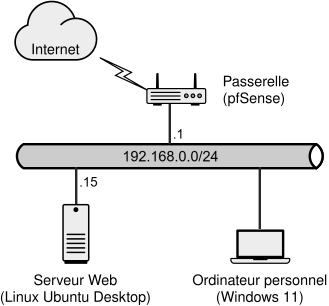

Ce travail mobilise des notions vues dans votre cours de systèmes d'exploitation. N'hésitez pas à demander de l'aide à votre professeur pour vous rafraîchir la mémoire sur les commandes à utiliser.

<details>
<summary>⭐ **Préparation des machines virtuelles**</summary>
<Row><Column>
Pour ce travail, vous devez vous procurer des machines virtuelles dans l'environnement Labinfo. Vous aurez besoin de trois VM:

- Un serveur Linux Ubuntu qui héberge un site Web à l'adresse `192.168.0.15`
- Un client Windows 11, sur laquelle mener l'attaque (son adresse IP est dynamique)
- Une passerelle *pfSense* pour communiquer avec Internet, à l'adresse 192.168.0.1

Le réseau local a pour adresse réseau `192.168.0.0/24` (masque de sous-réseau `255.255.255.0`). La passerelle agit également comme serveur DHCP et DNS. Toutes les VM sont déjà configurées pour vous, il suffit de les copier dans votre environnement.
</Column><Column>
:::note Schéma du réseau

:::
</Column></Row>

Suivez ces étapes pour créer les machines virtuelles:

1. Authentifiez-vous à Labinfo (https://labinfo.cegepmontpetit.ca/ui) avec votre identifiant du Collège.
2. Dans le client vSphere, activez la vue des **machines virtuelles** et naviguez dans `Modèles / 420-3S4`. **N'utilisez pas les modèles génériques!**
3. Pour chaque modèle commençant par TP2
   - Cliquez-droit et choisissez **Nouvelle VM à partir de ce modèle**
   - Donnez-lui le nom: `3S4-XX-TP2-NomDeLaVM`, où "XX" sont vos initiales et le nom de la VM est soit "Windows", "Linux" ou "Passerelle"
   - Sélectionnez l'emplacement de votre profil (sous "Petit" ou "Large") et cliquez sur Suivant
   - Sélectionnez la ressource de calcul correspondant à votre profil (P-### ou L-###) et cliquez sur Suivant
   - Cochez **vsanDatastore** et cliquez sur Suivant
   - Cochez **Personnaliser le matériel de cette machine virtuelle** (deuxième option) et cliquez sur Suivant
   - Dans la configuration des adapteur réseau, **remplacez `VM-MODELE (10)`** par l'un de vos **réseaux privés** (`P-###-##` ou `L-###-##`).
   - Attendez la fin de la copie avant de démarrer la machine virtuelle (la passerelle est très petite et elle se copie rapidement, mais les autres peuvent prendre quelques minutes à copier)
4. Une fois les machines virtuelles terminées, naviguez dans votre profil (sous le répertoire Petit ou Large). Vous devriez voir les trois VM.
5. Sélectionnez la **passerelle** puis démarrez-la (par le clic-droit ou le bouton dans la barre d'actions). Faites la même chose avec les machines **Linux** et **Windows**
6. Sélectionnez la machine Windows et cliquez sur **Lancer Remote Console**. Cela va ouvrir la VM dans VMware Workstation. (Vous pouvez aussi lancer la console Web, mais cette option est moins intéressante car elle ne permet pas le copier-coller)
7. Démarrez une session sur le poste Windows avec le compte `Administrateur` et le mot de passe `Passw0rd` (avec un P majuscule et un 0).

:::warning
Vos trois machines virtuelles doivent être interconnectées dans le même réseau local. Si vous êtes dans le programme **Développement d'applications**, vous disposez d'un profil Petit `P-###` qui inclut un seul réseau privé `P-###-01`. Si vous êtes en Administration d'infrastructures TI, vous disposez d'un profil Large `L-###` qui comprend 10 réseaux privés `L-###-01` à `L-###-10`. Assurez-vous de choisir un réseau qui n'est pas utilisé dans vos autres cours. Puisque la passerelle agit comme serveur DHCP, cela pourrait perturber vos autres cours.
:::

</details>

## Scénario

Bob Smith, un finissant du DEC, s'est fait offrir 5000 dollars par son oncle, surnommé "DaBoss", pour monter un petit site web pour l'entreprise familiale de plomberie. Ce site est hébergé sur un petit serveur Apache qui tourne sur une machine Linux Ubuntu.

## Partie 1: Attaque et collecte d'informations

Dans cette partie du travail, vous devez perpétrer une attaque contre le site Web.

:::info Votre mission
**Vous devez modifier la page contact du site:**

- Le numéro de **téléphone** doit être remplacé par **555-555-9876**
- Le lien vers le **courriel** de contact pour les clients potentiels doit être remplacé par **ouch.hacked@cem.ca**

La personne qui a développé le site se nomme Bob Smith. J'ai trouvé les informations suivantes en surveillant sa présence numérique:

- Né le 4 mars 1982 à Sherbrooke
- Son courriel est personnel est bobsmith@geemail.com
- Il a trois enfants: Luc (né le 2 octobre 2010), Kim (née le 6 juin 2012) et Sophie (née le 29 août 2014)
- Son adresse courriel a été trouvée dans une fuite sur le *dark web* l'an dernier. Le hash MD5 de son mot de passe est 57e788f9ceb6565e39d23061d7b3d8ca. Une attaque par force brute a permis de démontrer que le mot de passe qui a fuité est `Kim2012!`
 
Je paie 1000$ cash dans une enveloppe brune, échange sur un banc public dans un parc public.
:::

Dans le rapport, vous devez **documenter votre exploit** sous forme de recette **étape par étape** et garder une trace de tout ce que vous faites. Chaque étape doit être **numérotée** et doit montrer:

- La **commande** utilisée
- Une courte phrase indiquant l'**objectif** de la commande, son **effet** et l'**information** collectée
- Une **capture d'écran** montrant la **commande** et son **effet**.

## Partie 2: Implémentation des correctifs

Une fois que vous aurez réussi votre attaque, **contactez le professeur et montrez-lui la page Web modifiée**. Il vous donnera secrètement le mot de passe du compte DaBoss, qui possède les droits d'administration (sudo) sur le serveur. Pour cette partie du travail, vous pouvez utiliser le serveur Linux directement et vous authentifier avec le compte DaBoss.

En tant que DaBoss, vous devez implémenter **3 correctifs différents**. Chaque correctif doit, **à lui seul**, rendre l'attaque précédente **impossible à réaliser** tout en s'assurant que **le site est encore fonctionnel.**.

Vous devez documenter chaque correctif en expliquant:

- Quelles commandes ont été effectuées (avec captures d'écran)
- Quelle étape de l'exploit est brisée par ce correctif
- Une capture d'écran de l'exploit qui ne fonctionne plus
- Une copie d'écran du site toujours fonctionnel
- Si le correctif entraîne une perte de fonctionnalité, vous devez décrire l'impact

Les correctifs peuvent concerner, par exemple:

- Le pare-feu et l'accès réseau
- Les permissions dans le système de fichiers
- Les stratégies de mot de passe
- Les stratégies de sauvegarde
- Les antivirus et autres logiciels de sécurité
- Etc.

## Pour commencer, nmap

Pour commencer l'attaque, il faudra trouver une manière d'accéder à la machine Linux par le réseau, puisque vous n'avez pas accès "physique" au serveur. L'attaque doit donc se faire **à partir du poste Windows**. Vous pouvez commencer par rechercher des ouvertures en utilisant un scanneur de port.

Pour ce faire, ouvrez l'outil NMAP (il a été préinstallé sur la VM à partir de cette adresse: https://nmap.org/download#windows) puis saisissez l'adresse IP du serveur dans "Target" pour commencer le scan. L'outil va lister tous les ports TCP ouverts et accessibles.

On s'attend à ce que le port 80 soit ouvert, puisque ce serveur héberge un site Web HTTP. Mais s'il y en a d'autres, ça pourrait être le point de départ d'une tentative d'intrusion.

:::warning Attaque via le réseau
Toute l'attaque doit se faire depuis le poste Windows. L'attaquant n'a pas accès physique à la machine Linux; il doit perpétrer son attaque par le réseau. Si votre attaque nécessite un accès direct à la machine, vous avez mal compris la consigne et votre note pour cette partie sera 0.
:::

## Livrable

Le livrable pour ce TP est un rapport en format **markdown**, à déposer sur GitHub dans le dépôt fourni par votre professeur.

Le rapport doit comprendre 2 parties:

- Exploit (6 points)
- Correctifs (9 points, 3 points par correctif)

Étant donné le temps imparti et la possibilité de poser des questions sur plusieurs séances au professeur, chaque point sera accordé uniquement si l'**élément est complet et sans erreur** et noté au point près.

Le français doit être correct : utilisez au minimum le correcteur orthographique de Word et/ou Antidote. 2 points sont alloués à la qualité du français; cette évaluation portera sur la clarté, l'orthographe et la grammaire de votre rapport.

## Grille d'évaluation

Ce TP compte pour 15% de la note finale du cours (soit 37,5% du seuil des TP). Il est à faire individuellement. Vous avez jusqu'à la fin de la séance 2.9 pour le remettre conformément aux instructions qui vous ont été données par votre professeur.

```text
Attaque (exploit) ......  6 points
Correctif 1 ............  3 points
Correctif 2 ............  3 points
Correctif 3 ............  3 points
Qualité du français ....  2 points
                         -----------
                         17 points
```

:::warning Plagiat et intelligence artificielle
Attention, ce travail n'est pas à faire en équipe. Ton rapport est personnel et individuel. Tu t'exposes à du plagiat si tu reprends des parties d'un camarade ou si tu le rends disponible à d'autres personnes.

Si tu utilises l'intelligence artificielle pour ce travail, tu dois l'indiquer dans ton rapport en incluant **les prompts et les réponses**.
:::


## Modèle de rapport

Voici un modèle de rapport que vous pouvez utiliser pour votre remise. Vous devez produire votre rapport en format Markdown. **Le fichier doit obligatoirement avoir l'extension `.md`.**

```markdown
# TP2 Cybersécurité
- Nom: (votre prénom et nom)
- Matricule: (votre matricule)
- Groupe: (votre numéro de groupe)

## Attaque (exploit)

Voici les étapes détaillées pour pouvoir modifier le courriel / téléphone sur la page demandée:

### Étape 1
Description de l'étape + capture d'écran

### Étape 2
Description de l'étape + capture d'écran

### Étape 3
Description de l'étape + capture d'écran

### ....

## Correctif 1

Commandes à effectuer ou étapes à mettre en place. 

Capture d'écran de l'exploit qui ne fonctionne plus.

## Correctif 2

Commandes à effectuer ou étapes à mettre en place.

Capture d'écran de l'exploit qui ne fonctionne plus. 

## Correctif 3

Commandes à effectuer ou étapes à mettre en place. 

Capture d'écran de l'exploit qui ne fonctionne plus.

```

:::tip Insérer une capture d'écran
Pour insérer une image dans un document MarkDown, il suffit d'ajouter le fichier (.png, .jpeg, etc.) dans ton dépôt, en les organisant de cette façon:

```text
./
├── assets/
│   ├── capture1.png
│   └── capture2.png
└── rapport-tp2.md
```

Puis, vous pouvez les référencer dans votre markdown de la manière suivante:

```markdown

```

Quant à la capture d'écran elle-même, je recommande d'utiliser le logiciel [GreenShot](https://getgreenshot.org/). Il est gratuit et est déjà installé dans les laboratoires du collège.
:::
